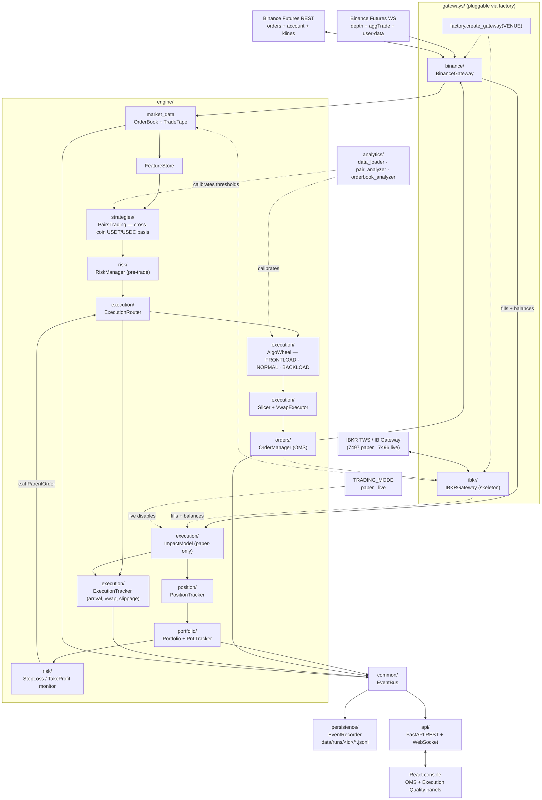

# Algo Trading Hub

End-to-end trading console: a React frontend that observes and controls the **ALPHA-7** Python trading engine running against the Binance USDT-M Futures Testnet.

## Architecture



Source kept editable at `backend/docs/architecture.mmd`. Full architecture deep-dive in `backend/README.md`.

## Layout

```
algo-trading-hub/
  src/                     React + TanStack Start frontend (Cloudflare Workers SSR)
    routes/index.tsx       the dashboard
    hooks/useAlgoStream.ts REST + WS client hook bound to the dashboard
    lib/api.ts             typed fetch + WS helpers
  backend/                 Python trading engine + FastAPI surface
    main.py                runs engine + uvicorn in one event loop
    engine/                strategy-agnostic core (orders, exec, risk, ...)
    gateways/              venue adapters (Binance Futures Testnet)
    api/                   FastAPI REST + /ws WebSocket
    analytics/             offline calibration jobs
    docs/architecture.png  the image above
```

## Prerequisites

- Node.js 20+ (or Bun 1.2+) for the frontend
- Python 3.11+ for the backend
- A Binance Futures **Testnet** API key + secret (https://testnet.binancefuture.com)

## Run it locally

Two terminals.

**Backend** (one-shot on Windows):

```powershell
cd backend
copy .env.example .env
# paste your testnet API key + secret into .env
.\run.bat
```

POSIX or manual:

```bash
cd backend
python -m venv .venv && source .venv/bin/activate
pip install -r requirements.txt
cp .env.example .env  # then edit
python main.py
# -> serving on http://127.0.0.1:8000
```

**Frontend**:

```bash
bun install        # or: npm install
bun run dev        # or: npm run dev
# -> http://localhost:5173
```

The dashboard hydrates from `GET /api/state` on mount and stays live over `/ws`. Control buttons (Start / Pause / Stop / Flatten) and the risk slider issue REST calls; the engine fans the resulting status changes back over the WebSocket.

## Backend deep-dive

See `backend/README.md` for the full architecture, module-by-module walk-through, env var reference, REST + WS contract, testing notes, and troubleshooting.
