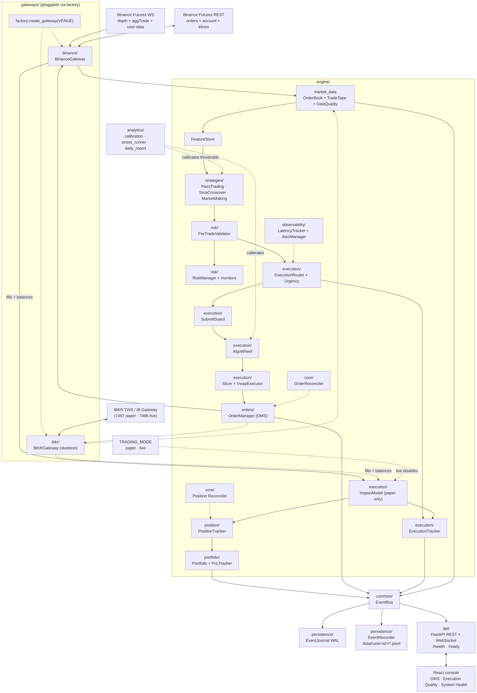

# Algo Trading Hub

End-to-end trading console: a React frontend that observes and controls a Python trading engine running against the Binance USDT-M Futures Testnet. Two strategies ship out of the box — a volume-weighted cross-coin USDT/USDC basis pairs-trader and a multi-symbol SMA crossover scanner — and the dashboard hot-swaps between them at runtime via the strategy toggle in the Control panel (`POST /api/control/strategy`). The engine is strategy-agnostic, so additional plug-ins surface in the toggle without UI changes.

## Architecture



Source kept editable at [`backend/docs/architecture.mmd`](backend/docs/architecture.mmd). Full architecture deep-dive in [`backend/README.md`](backend/README.md).

### System capabilities (7 layers)

| Layer | Repo paths | Status |
|-------|------------|--------|
| 1 Platform | `common/`, `persistence/journal.py`, `/health`, `/ready` | Implemented |
| 2 Market data | `engine/market_data/`, `data_quality.py` | Implemented |
| 3 Execution | `gateways/`, `engine/execution/` | Binance production; IBKR skeleton |
| 4 OMS | `engine/orders/`, `order_reconciliation.py` | Implemented |
| 5 Risk | `engine/risk/pretrade_validator.py`, monitors | Implemented |
| 6 Strategy | `engine/strategies/`, `analytics/` | Implemented + offline stress |
| 7 UI & ops | `src/`, `api/`, alerts, reports | Implemented |

## Layout

```
algo-trading-hub/
  src/                     React + TanStack Start frontend (Cloudflare Workers SSR)
    routes/index.tsx       the dashboard
    hooks/useAlgoStream.ts REST + WS client hook bound to the dashboard
    lib/api.ts             typed fetch + WS helpers
    components/algo/types.ts  view-model shapes (mirrors backend/api/schemas.py)
  backend/                 Python trading engine + FastAPI surface
    main.py                runs engine + uvicorn in one event loop
    engine/                strategy-agnostic core (orders, exec, risk, observability, ...)
    gateways/              venue adapters (Binance Futures Testnet)
    api/                   FastAPI REST + /ws WebSocket
    analytics/             offline calibration jobs
    docs/architecture.png  the image above
```

## Prerequisites

- Node.js 20+ (or Bun 1.2+) for the frontend
- Python 3.11+ for the backend
- A Binance Futures **Testnet** API key + secret (https://testnet.binancefuture.com)

## Run it locally

Two terminals.

**Backend** (one-shot on Windows):

```powershell
cd backend
copy .env.example .env
# set BINANCE_API_KEY + BINANCE_API_SECRET in .env (other overrides optional; defaults in backend/common/config.py)
.\run.bat
```

POSIX or manual:

```bash
cd backend
python -m venv .venv && source .venv/bin/activate
pip install -r requirements.txt
cp .env.example .env  # add keys; optional overrides — defaults in backend/common/config.py
python main.py
# -> serving on http://127.0.0.1:8000
```

**Frontend**:

```bash
bun install        # or: npm install
bun run dev        # or: npm run dev
# -> http://localhost:5173
```

In dev, Vite proxies `/api` and `/ws` to `http://127.0.0.1:8000`, so the dashboard talks to the API same-origin (no CORS). Set `VITE_API_BASE` if your backend URL differs.

The dashboard hydrates from `GET /api/state` on mount and stays live over `/ws`. The strategy toggle, label, description and paper/live mode shown in the UI come from that hydrate — no values are hardcoded on the frontend, and there is no mock data wired in dev or prod (mocks live only under `backend/tests/`). Control buttons (Start / Pause / Stop / Flatten), the risk slider, and the strategy picker issue REST calls; the engine fans the resulting status changes back over the WebSocket. Position-chart candles are pulled live via `GET /api/klines`.

Equity correctness is anchored to the venue. Wallet balances are tracked per-asset (Binance Futures keeps separate USDT and USDC wallets) so a partial `ACCOUNT_UPDATE` event never wipes an unreported leg, and a 30-second REST resync runs as a safety net behind the live stream so the dashboard equity always converges back to Binance.

In **LIVE** mode the backend will **refuse to start** if your venue is still pointed at a sandbox/testnet, so the portfolio cash/equity always seeds from your **real account balance**.

### Failsafes at a glance

A unified circuit-breaker covers the engine end-to-end so extreme events have a defined safety fallback:

- **Unified pre-trade** — `PreTradeValidator` (fat-finger, signal dedup, limit collar, group parity) before any parent reaches the router.
- **Matching / reconcile** — order-level reconcile vs venue open orders; position reconcile; optional `RECOVER_ON_START` WAL replay.
- **In-flight execution** — urgency profiles, passive bid/ask peg, deterministic client order IDs, per-parent slippage abort, submit throttles.
- **Portfolio guards** — HWM drawdown, daily-loss kill, consecutive-loss streak, execution-quality blowout (`MAJOR` latched until re-arm).
- **System-level** — MD quality (gaps, crossed book, resnapshot), WS/user-data staleness pause, webhook alerts, `/health` + `/ready`, System Health dashboard panel.

`MAJOR` breaches automatically flatten + latch; the operator clears them via `POST /api/control/breakers/rearm`. `MINOR` breaches auto-resume after a cooldown. See `backend/README.md` "Failsafes — circuit-breaker matrix" for the full list and tunables.

## Backend deep-dive

See `backend/README.md` for the full architecture, module-by-module walk-through, env var reference, REST + WS contract, testing notes, and troubleshooting.
