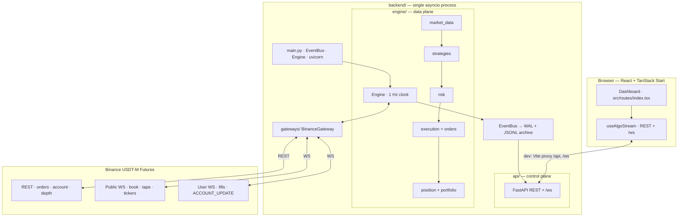
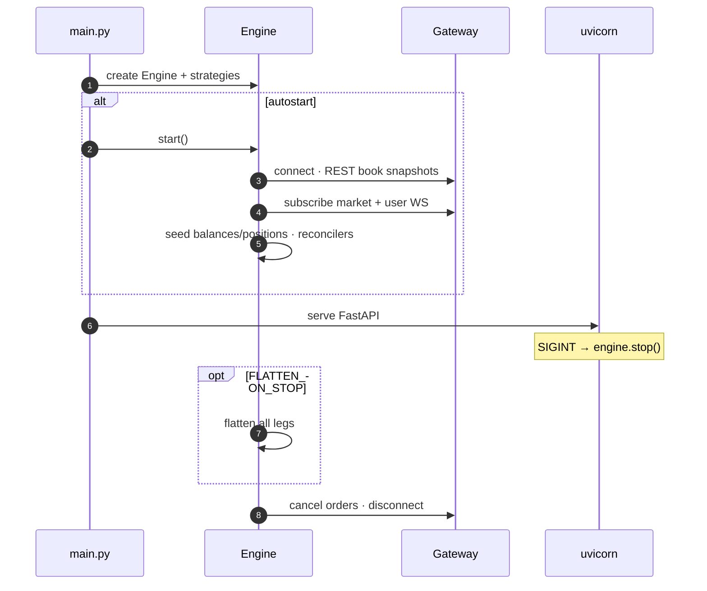
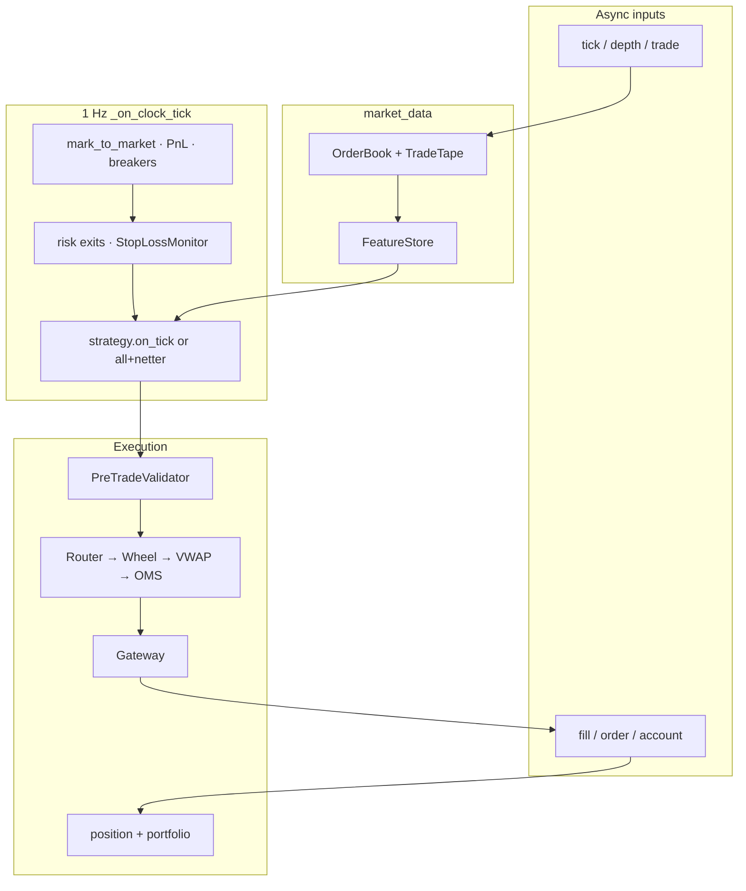
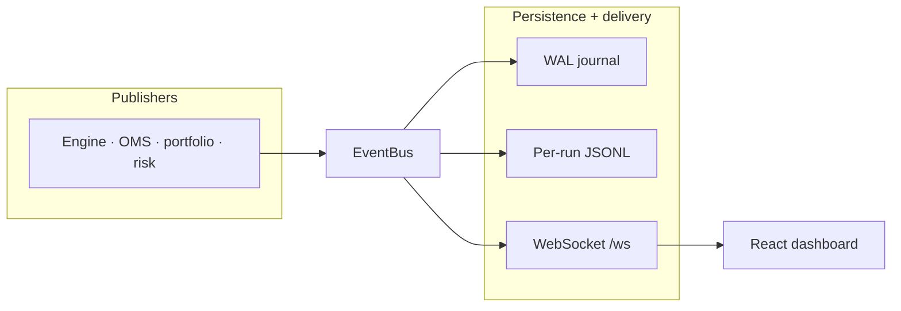
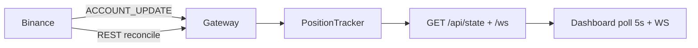
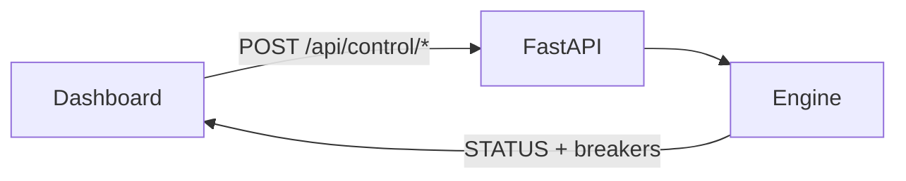
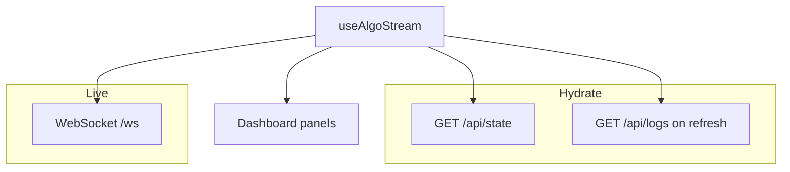
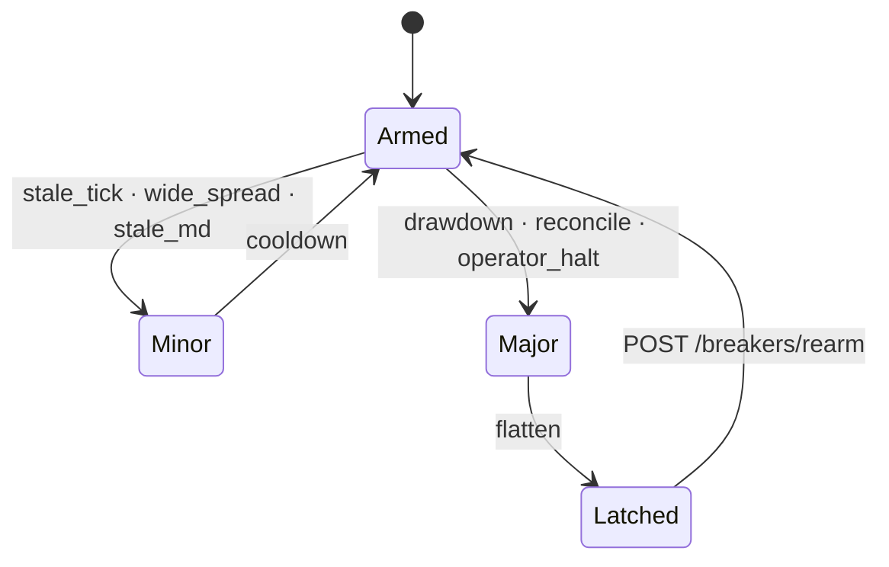

# Algo Trading Hub

A full-stack **algorithmic trading console**: a React dashboard observes and controls a Python trading engine on **Binance USDT-M Futures** (testnet by default). The engine is **strategy-agnostic** — new `StrategyBase` plug-ins register at boot and appear in the UI strategy picker without frontend changes.

| Layer | Stack | Responsibility |
|-------|-------|----------------|
| **Frontend** | React 19 · TanStack Start · Vite · shadcn/ui | Live dashboard, operator controls, charts, system health |
| **Backend** | Python 3.11+ · FastAPI · asyncio | Trading engine · REST · WebSocket · run archives |
| **Venue** | Binance Futures (testnet default) | Market data · order routing · balances · positions |

**Documentation index:** [`docs/README.md`](docs/README.md)

| Audience | Document |
|----------|----------|
| Engineering (engine, API, config, strategies) | [`backend/README.md`](backend/README.md) |
| Architecture signpost (diagrams + component map) | [`docs/ARCHITECTURE.md`](docs/ARCHITECTURE.md) |
| Operations / SRE (health, incidents, deployment) | [`docs/OPERATIONS.md`](docs/OPERATIONS.md) |
| Security (threat model, secrets, hardening) | [`docs/SECURITY.md`](docs/SECURITY.md) |
| Risk / compliance (records, governance, disclaimer) | [`docs/COMPLIANCE_AND_GOVERNANCE.md`](docs/COMPLIANCE_AND_GOVERNANCE.md) |
| Architecture diagrams (editable `.mmd`) | [`backend/docs/`](backend/docs/) |
| Python contribution conventions | [`backend/AGENTS.md`](backend/AGENTS.md) |

**Disclaimer:** This repository is software for engineering and research. It is **not** certified for any specific regulatory regime; institutional use requires your own legal, risk, and security sign-off ([`docs/COMPLIANCE_AND_GOVERNANCE.md`](docs/COMPLIANCE_AND_GOVERNANCE.md)).

---

## What this system does

1. **Ingest** live L2 books, trade tape, and account streams from the venue.
2. **Compute** microstructure features (spread, imbalance, hit ratios) on every symbol in the active universe.
3. **Decide** via one active strategy (or `all` with signal netting): pairs basis, SMA crossover, or market making.
4. **Protect** with layered pre-trade checks, circuit breakers, and portfolio kill switches.
5. **Execute** parent orders through an algo wheel → VWAP slicer → child limits with passive peg and market fallback.
6. **Reconcile** positions and open orders against the venue on a timer and after WS reconnects.
7. **Publish** state to the UI over WebSocket and persist every run under `backend/data/runs/`.

The browser **never talks to Binance** — it mirrors engine state via `GET /api/state` and `/ws`.

---

## Design principles

| Principle | How it shows up |
|-----------|-----------------|
| **Single process** | `main.py` runs Engine + uvicorn on one asyncio loop — no IPC, no shared-memory locks for live state. |
| **Venue seam** | `GatewayInterface` — engine code never imports Binance; tests swap in `MockGateway`. |
| **Event-driven UI** | `EventBus` fans out fills, positions, breakers; API/WebSocket are subscribers, not owners of truth. |
| **Venue is truth** | Positions and wallets heal from REST/`ACCOUNT_UPDATE` when local books drift. |
| **Fail closed on LIVE** | `TRADING_MODE=live` refuses sandbox hosts so equity seeds from a real account. |
| **No mock data in prod** | Mocks exist only under `backend/tests/`. |

---

## System architecture

One Python process owns the engine and API. The gateway is the only component that speaks to the exchange.



**Editable source:** [`backend/docs/architecture-system.mmd`](backend/docs/architecture-system.mmd)

### Boot and shutdown lifecycle



**Editable source:** [`backend/docs/architecture-lifecycle.mmd`](backend/docs/architecture-lifecycle.mmd)

### Per-tick trading path (1 Hz + market callbacks)

Market data arrives on WebSocket callbacks; the **1 Hz clock** drives mark-to-market, risk exits, and strategy ticks.



**Per-tick diagram — source:** [`backend/docs/architecture-tick.mmd`](backend/docs/architecture-tick.mmd)

### Events, persistence, and UI stream

**Events diagram — source:** [`backend/docs/architecture-events.mmd`](backend/docs/architecture-events.mmd)



| `EventType` | Archive file | UI use |
|-------------|--------------|--------|
| `FILL` | `fills.jsonl` | Trades panel |
| `ORDER_UPDATE` | `orders.jsonl` | OMS working orders |
| `PARENT_UPDATE` | `parents.jsonl` | In-flight VWAP progress |
| `EXECUTION_REPORT` | `executions.jsonl` | Execution quality TCA |
| `POSITION` | `positions.jsonl` | Positions table |
| `EQUITY` | `equity.jsonl` | Equity chart |
| `STATUS` | `status.jsonl` | Engine state · latency metrics |
| `BREAKER` | `breakers.jsonl` | Breaker audit |
| `LOG` | `logs.jsonl` | Log panel |

### Position sync: venue → engine → dashboard



Layers: startup REST seed · user-data WS merge · reconnect resync · periodic reconcile with optional heal · dashboard safety poll. Details: [`backend/README.md#position--dashboard-sync`](backend/README.md#position--dashboard-sync).

**Editable source:** [`backend/docs/architecture-data-sync.mmd`](backend/docs/architecture-data-sync.mmd)

### Operator control plane



| Control | Endpoint | Engine effect |
|---------|----------|---------------|
| Start | `POST /start` | `connect()` + WS + reconcilers |
| Pause / Resume | `POST /pause` · `/resume` | Stop / resume strategy ticks |
| Stop | `POST /stop` | Optional flatten · disconnect |
| Flatten | `POST /flatten` | Pause · cancel · venue sync · close legs · stay paused |
| Strategy | `POST /strategy` | Hot-swap active strategy (no restart) |
| Halt | `POST /breakers/trip` | MAJOR breaker · flatten |
| Kill | `POST /shutdown` | Exit Python process |

**Editable source:** [`backend/docs/architecture-control.mmd`](backend/docs/architecture-control.mmd)

### Full diagram index

| File | Topic |
|------|--------|
| [`architecture-system.mmd`](backend/docs/architecture-system.mmd) | End-to-end system context |
| [`architecture-lifecycle.mmd`](backend/docs/architecture-lifecycle.mmd) | Boot / shutdown sequence |
| [`architecture-tick.mmd`](backend/docs/architecture-tick.mmd) | Hot path + background loops |
| [`architecture-events.mmd`](backend/docs/architecture-events.mmd) | EventBus fan-out |
| [`architecture-gateway.mmd`](backend/docs/architecture-gateway.mmd) | Binance adapter internals |
| [`architecture-data-sync.mmd`](backend/docs/architecture-data-sync.mmd) | Position & wallet truth |
| [`architecture-control.mmd`](backend/docs/architecture-control.mmd) | Operator REST controls |
| [`architecture-frontend.mmd`](backend/docs/architecture-frontend.mmd) | React data plane |
| [`architecture-execution.mmd`](backend/docs/architecture-execution.mmd) | Parent-order sequence |
| [`architecture-strategies.mmd`](backend/docs/architecture-strategies.mmd) | Strategy modes & netting |
| [`architecture-breakers.mmd`](backend/docs/architecture-breakers.mmd) | Circuit breaker states |
| [`architecture.mmd`](backend/docs/architecture.mmd) | Compact single-page view |

Preview diagrams: [mermaid.live](https://mermaid.live) or VS Code Mermaid extension — paste `.mmd` contents.

---

## Strategies at a glance

| Strategy | `name` | Universe | Risk model | Entry idea |
|----------|--------|----------|------------|------------|
| **Pairs** | `pairs_trading` | `SYMBOLS` USDT+USDC perps | Self-managed (z-space SL/TP) | Volume-weighted implied USDT/USDC basis deviation |
| **SMA** | `sma_crossover` | `SMA_SYMBOLS` | Engine per-leg brackets | Fast/slow SMA cross per symbol |
| **Market making** | `market_making` | `MM_SYMBOLS` | Engine per-leg brackets | Fade/follow composite of skew · imbalance · tape |
| **All** | `all` | Union of above | Per-strategy rules | Net signals per symbol before one execution path |

Hot-swap: `POST /api/control/strategy` with `{ "name": "pairs_trading" }` (or `sma_crossover`, `market_making`, `all`). Boot default: `STRATEGY` in `.env`.

---

## Platform layers

| # | Layer | Paths | Responsibility |
|---|-------|-------|----------------|
| 0 | **Venue** | Binance REST + WS | Orders, balances, market data |
| 1 | **Gateway** | `backend/gateways/` | `GatewayInterface` · signing · reconnect · filters |
| 2 | **Platform** | `backend/common/`, `backend/engine/persistence/` | Config, `EventBus`, WAL, run bootstrap & JSONL archives |
| 3 | **Market data** | `backend/engine/market_data/` | L2 book, tape, features, data-quality guards |
| 4 | **Strategy** | `backend/engine/strategies/`, `backend/analytics/` | Live signals; offline calibration |
| 5 | **Risk** | `backend/engine/risk/`, `backend/engine/portfolio/`, `backend/engine/position/` | Pre-trade, monitors, circuit breakers |
| 6 | **Execution** | `backend/engine/execution/`, `backend/engine/orders/` | Wheel, VWAP, OMS, TCA |
| 7 | **API & UI** | `backend/api/`, `src/` | REST, WebSocket, React console |

Dependency rule: `backend/common/` ← `backend/gateways/` + `backend/engine/` ← `backend/api/` + `backend/analytics/`. Cross-module coupling is **only** through `EventBus`.

---

## Repository layout

Paths below are from the **repo root** (`algo-trading-hub/`). Build artefacts (`dist/`, `node_modules/`, `.venv/`) are omitted.

```
algo-trading-hub/
├── docs/                         # Operations, security, compliance (see docs/README.md)
├── src/                          # React dashboard (TanStack Start)
│   ├── routes/index.tsx          # Main trading console
│   ├── hooks/useAlgoStream.ts    # REST hydrate + WebSocket + resync policy
│   ├── lib/api.ts                # Typed HTTP/WS client
│   └── components/algo/
│       ├── types.ts              # View models (mirror backend/api/schemas.py)
│       ├── EquityChart.tsx
│       ├── PositionChartDialog.tsx
│       └── SettingsDialog.tsx
├── backend/                      # Python engine + API
│   ├── main.py                   # Entry: engine + uvicorn
│   ├── common/                   # Settings, EventBus, shared types
│   ├── engine/                   # Strategy-agnostic core (incl. persistence/, market_data/, …)
│   ├── gateways/                 # Venue adapters (Binance, IBKR skeleton)
│   ├── api/                      # FastAPI routes + /ws
│   ├── analytics/                # Offline calibration
│   ├── scripts/                  # Optional tooling (e.g. live strategy harnesses)
│   ├── tests/                    # pytest (mocks only here)
│   ├── docs/                     # Architecture *.mmd sources
│   ├── data/                     # Run archives & cache (mostly gitignored)
│   ├── requirements.txt
│   ├── pyproject.toml
│   ├── run.bat
│   ├── AGENTS.md
│   └── .env.example
├── package.json
├── vite.config.ts                # Dev proxy → backend :8000
├── wrangler.jsonc                # Cloudflare Workers (TanStack Start production build)
├── tsconfig.json
├── components.json               # shadcn/ui
└── eslint.config.js
```

`backend/common/config.py` hosts default `Settings`; HTTP health routes live in `backend/api/routes/health.py`.

---

## Prerequisites

| Requirement | Notes |
|-------------|-------|
| **Node.js 20+** or **Bun 1.2+** | Frontend dev server |
| **Python 3.11+** | Backend engine + API |
| **Binance Futures Testnet** keys | https://testnet.binancefuture.com |

---

## Run locally

Use **two terminals**.

### 1. Backend

**Windows:**

```powershell
cd backend
copy .env.example .env
# Set BINANCE_API_KEY and BINANCE_API_SECRET
.\run.bat
```

**macOS / Linux:**

```bash
cd backend
python -m venv .venv && source .venv/bin/activate
pip install -r requirements.txt
cp .env.example .env
python main.py
```

- API: **http://127.0.0.1:8000** (REST + `/ws`)
- Engine boots **stopped** by default — press **Start** in the UI or `POST /api/control/start`
- Auto-start: `ENGINE_AUTOSTART=true` or `python main.py --engine`
- API-only (engine never started): `python main.py --no-engine`

### 2. Frontend

```bash
bun install        # or: npm install
bun run dev        # or: npm run dev
```

- UI: **http://localhost:5173**
- Vite proxies `/api` and `/ws` → `127.0.0.1:8000` (same-origin, no CORS)
- Override API host: `VITE_API_BASE` in `.env`

---

## Dashboard behaviour

### Data flow



**Editable source:** [`backend/docs/architecture-frontend.mmd`](backend/docs/architecture-frontend.mmd)

### Resync policy (`useAlgoStream.ts`)

| Trigger | Action |
|---------|--------|
| Initial mount | Full `GET /api/state` hydrate |
| Every **5 s** | Re-fetch state (safety net if WS events missed) |
| WebSocket reconnect | Debounced full hydrate |
| WS disconnected | 5 s poll continues |
| Tab regains focus | Full hydrate |
| Manual **Refresh** | State + logs + settings |

### Panels

| Panel | Source |
|-------|--------|
| Portfolio / equity | `equity` events + `/api/state` |
| Positions + chart | `position` + `GET /api/klines` |
| OMS | `order` events |
| Execution quality | `parent` · `execution` |
| System health | `status` (latency, WS age, reconcile flags) |
| Logs / breakers | `log` · `breaker` |

### Controls

- **Start / Pause / Stop / Resume** — engine lifecycle
- **Flatten** — pause → cancel → sync venue → close each leg (market or VWAP by size/spread) → engine stays **paused** until Resume
- **Strategy picker** — hot-swap without restart
- **Risk slider** — `PATCH /api/control/risk` → `max_risk_pct`
- **Halt** — `POST /api/control/breakers/trip` (trading halt + flatten)
- **Kill** — `POST /api/control/shutdown` (exit process; not the trading kill switch)

### What to watch in System Health

| Signal | Meaning |
|--------|---------|
| **Venue sync age** (`user_data_age_sec`) | Low when user-data WS or periodic REST reconcile has refreshed truth; **`user_ws_event_age_sec`** can stay high quietly while holding exposure |
| **Order reconcile** | Should be OK; mismatch = venue vs OMS drift |
| **`reconcile_mismatch` breaker** | Qty drift detected (healed if `RECONCILE_HEAL_ON_MISMATCH=true`) |

Treat open positions as **untrusted** until user-data is fresh and reconcile is clean.

---

## Safety overview

Unified **circuit breaker** across the stack:



| Stage | Components |
|-------|------------|
| **Pre-trade** | `PreTradeValidator` — fat finger, dedup, spread collar, group parity |
| **Submit** | `SubmitGuard` — open parents cap, global rate limit |
| **In-flight** | Urgency profiles, passive peg, slippage abort per parent |
| **Portfolio** | HWM drawdown, daily loss, consecutive losses, exec-quality kill |
| **Reconcile** | Position + open-order sync vs venue; auto-heal optional |
| **System** | MD quality, WS staleness pause, webhooks, `/health` + `/ready` |

`MAJOR` → auto-flatten + latch until `POST /api/control/breakers/rearm`. `MINOR` → auto-resume after cooldown. **Reduce-only** orders bypass entry breakers so exits always reach the venue.

Full matrix: [`backend/README.md — Failsafes`](backend/README.md#failsafes--circuit-breaker-matrix).

---

## Trading modes

| Mode | Banner | Notes |
|------|--------|-------|
| `paper` (default) | INFO | Testnet / demo endpoints OK |
| `live` | WARN | Refuses sandbox hosts; real account balance seeds equity |

Flip venue to mainnet (`BINANCE_TESTNET=false`, mainnet REST/WS URLs) **and** set `TRADING_MODE=live`.

---

## Learn more

| Topic | Location |
|-------|----------|
| Module walk-through, env vars, API contract | [`backend/README.md`](backend/README.md) |
| Position & dashboard sync | [`backend/README.md#position--dashboard-sync`](backend/README.md#position--dashboard-sync) |
| Pairs / SMA / MM strategy math | [`backend/README.md#module-deep-dives`](backend/README.md#module-deep-dives) |
| Run archives & post-mortem | [`backend/README.md#run-archive`](backend/README.md#run-archive) |
| Architecture signpost & component map | [`docs/ARCHITECTURE.md`](docs/ARCHITECTURE.md) |
| pytest suite map | [`backend/README.md#testing`](backend/README.md#testing) |
| Operations runbook (health, incidents, prod checklist) | [`docs/OPERATIONS.md`](docs/OPERATIONS.md) |
| Security model & hardening | [`docs/SECURITY.md`](docs/SECURITY.md) |
| Compliance, records, governance | [`docs/COMPLIANCE_AND_GOVERNANCE.md`](docs/COMPLIANCE_AND_GOVERNANCE.md) |
| Full documentation register | [`docs/README.md`](docs/README.md) |
| Code style & layers | [`backend/AGENTS.md`](backend/AGENTS.md) |
