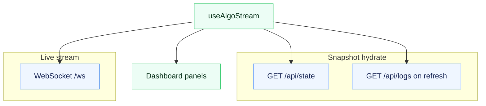
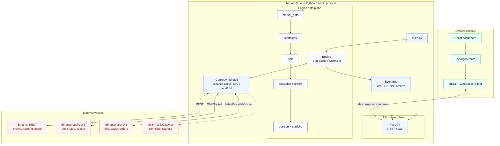
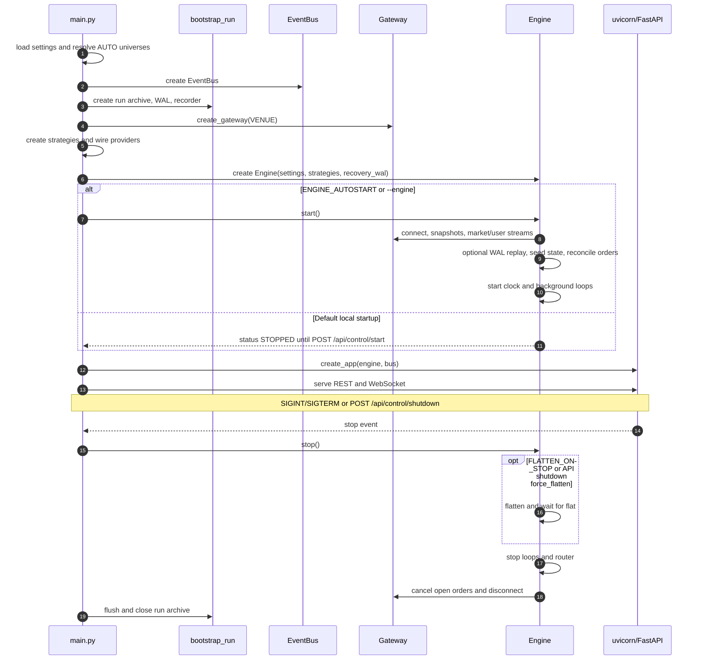
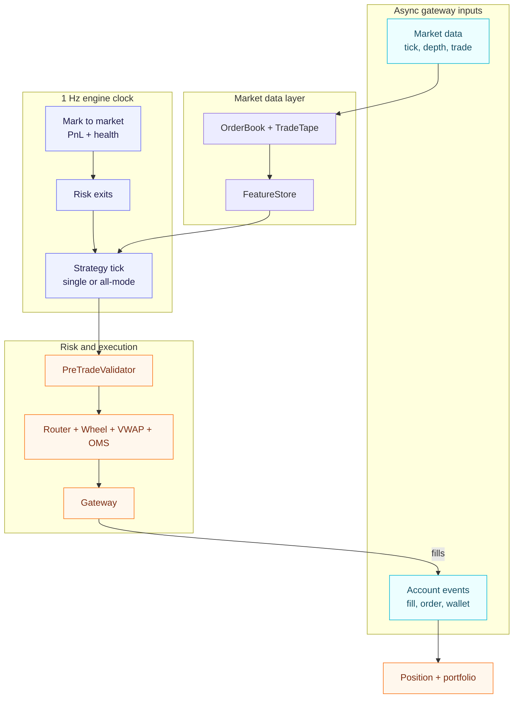
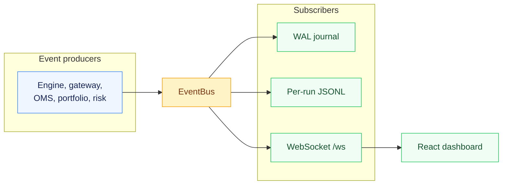
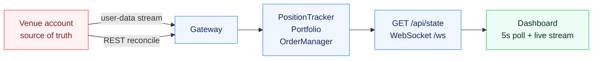
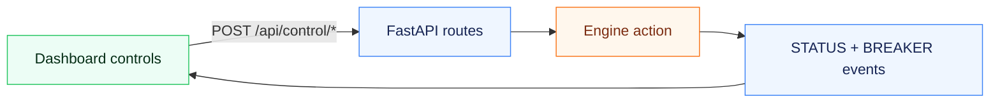
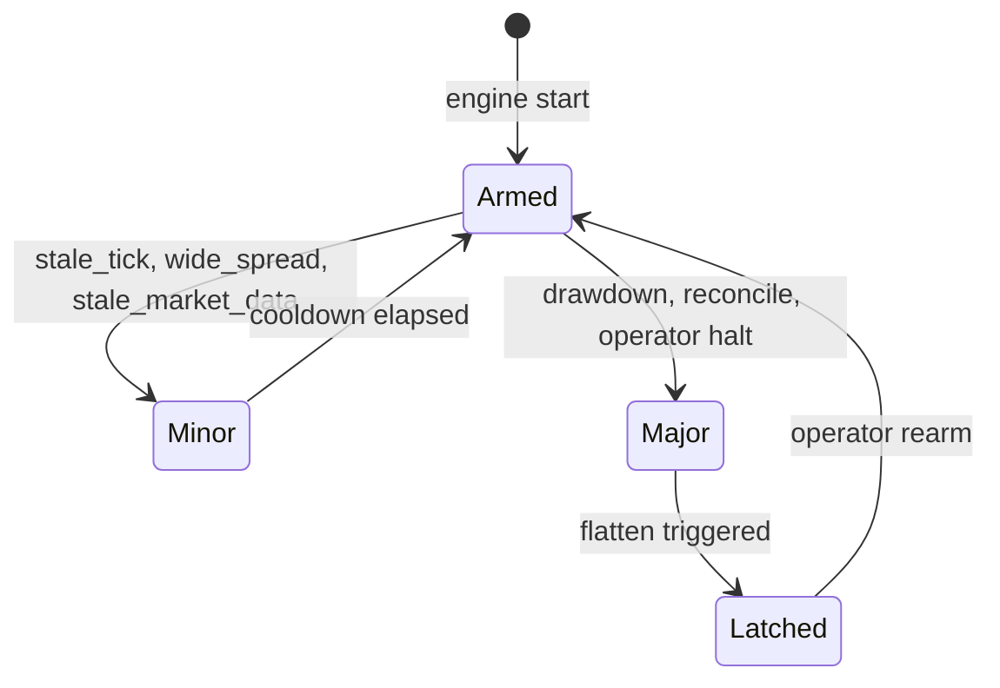

# Algo Trading Hub

A full-stack **algorithmic trading console**: a React dashboard observes and controls a Python trading engine on **Binance USDT-M Futures** (testnet by default). The engine is **strategy-agnostic** - new `StrategyBase` plug-ins register at boot and appear in the UI strategy picker without frontend changes.

| Layer | Stack | Responsibility |
|-------|-------|----------------|
| **Frontend** | React 19, TanStack Start, Vite, shadcn/ui | Live dashboard, operator controls, charts, system health |
| **Backend** | Python 3.11+, FastAPI, asyncio | Trading engine, REST, WebSocket, run archives |
| **Venue gateways** | Binance Futures active; IBKR scaffold | Market data, order routing, balances, positions |

**Full documentation register:** [`docs/README.md`](docs/README.md)

**Disclaimer:** This repository is software for engineering and research. It is **not** certified for any specific regulatory regime; institutional use requires your own legal, risk, and security sign-off ([`docs/COMPLIANCE_AND_GOVERNANCE.md`](docs/COMPLIANCE_AND_GOVERNANCE.md)).

---

## What this system does

1. **Ingest** live L2 books, trade tape, and account streams from the venue.
2. **Compute** microstructure features (spread, imbalance, hit ratios) on every symbol in the active universe.
3. **Decide** via one active strategy (or `all` with signal netting): pairs basis, SMA crossover, or market making.
4. **Protect** with layered pre-trade checks, circuit breakers, and portfolio kill switches.
5. **Execute** parent orders through an algo wheel, VWAP slicer, and child limits with passive peg and market fallback.
6. **Reconcile** positions and open orders against the venue on a timer and after WS reconnects.
7. **Publish** state to the UI over WebSocket and persist every run under `backend/data/runs/`.

The browser **never talks to Binance** - it mirrors engine state via `GET /api/state` and `/ws`.

---

## Getting oriented

This README is the entry point for a clean local setup and code review. It covers the Python
3.11 backend setup, Node frontend setup, Binance Demo/Testnet key placement,
safe paper-mode defaults, and an offline backtest path when a local kline
library is available. Detailed backend internals live in [`backend/README.md`](backend/README.md).

The safest first-run profile is:

```dotenv
TRADING_MODE=paper
BINANCE_TESTNET=true
ENGINE_AUTOSTART=false
```

This starts the API and dashboard without automatically starting the trading
engine.

Recommended first pass:

1. Follow [Quick start](#quick-start) to launch the local dashboard.
2. Open the dashboard and inspect state, strategy controls, circuit breakers,
   OMS panels, logs, and backtesting views.
3. Run any needed [validation and optional checks](#validation-and-optional-checks).

Where to start reading the code:

| Goal | Start here |
|---|---|
| Source-tree map | [`docs/STRUCTURE.md`](docs/STRUCTURE.md) |
| Backend infrastructure | [`backend/README.md`](backend/README.md), then [`backend/main.py`](backend/main.py) |
| Engine lifecycle | [`backend/engine/core/engine.py`](backend/engine/core/engine.py) |
| API and WebSocket surface | [`backend/api/routes/`](backend/api/routes/), [`backend/api/ws.py`](backend/api/ws.py) |
| Venue adapter boundary | [`backend/gateways/gateway_interface.py`](backend/gateways/gateway_interface.py), [`backend/gateways/binance/`](backend/gateways/binance/), [`backend/gateways/ibkr/`](backend/gateways/ibkr/) |
| Strategy implementations | [`backend/engine/strategies/`](backend/engine/strategies/) |
| Dashboard data flow | [`src/routes/index.tsx`](src/routes/index.tsx), [`src/hooks/useAlgoStream.ts`](src/hooks/useAlgoStream.ts), [`src/lib/api.ts`](src/lib/api.ts) |

Quick validation checklist:

| Check | Command / location | Expected result |
|---|---|---|
| Backend tests | `cd backend; python -m pytest -q` | Full pytest suite passes |
| Frontend lint | `npm.cmd run lint` on Windows, or `npm run lint` elsewhere | No lint errors; warnings may remain |
| Frontend build | `npm.cmd run build` on Windows, or `npm run build` elsewhere | Production build completes |
| Backend health | `Invoke-RestMethod http://127.0.0.1:8000/health` | `status: ok` |
| Trading readiness | `Invoke-RestMethod http://127.0.0.1:8000/ready` | `ready=false` until the engine is started |
| Smoke backtest | [Optional no-key backtest smoke test](#optional-no-key-backtest-smoke-test) | Runs without Binance keys after local kline data exists |

---

## Prerequisites

| Requirement | Notes |
|-------------|-------|
| **Git** | Clone the repository |
| **Node.js 20+** | Frontend dev server (`npm`) |
| **Python 3.11+** | Backend engine + API |
| **Binance Futures Demo/Testnet keys** | Optional for API-only startup with explicit symbol lists and for the offline smoke test; required before starting the engine against Binance account/order endpoints |

---

## Quick Start

For a Windows local run, start from the repo root and use the local
launcher. It creates `backend/.env` if missing, detects an active Conda
environment first, otherwise uses `backend/.venv`, installs missing Python and
Node dependencies, and starts the backend and frontend together.

```powershell
git clone https://github.com/Zendragon98/algo-trading-hub.git
cd algo-trading-hub
.\run-local.ps1
```

Then open:

```text
http://localhost:5173
```

The backend API is served at:

```text
http://127.0.0.1:8000
```

Use Ctrl+C in the launcher terminal to stop both processes.

The engine starts stopped by default. This lets the dashboard load without
placing orders or connecting to Binance account/order endpoints. If any symbol
list is set to `AUTO`, boot still uses public Binance REST metadata to resolve
the universe. To start the engine against Binance Demo/Testnet, add keys to
`backend/.env`, then press **Start** in the dashboard:

```dotenv
BINANCE_API_KEY=replace_with_demo_or_testnet_key
BINANCE_API_SECRET=replace_with_demo_or_testnet_secret
```

Safe first-run settings are already the defaults:

```dotenv
TRADING_MODE=paper
BINANCE_TESTNET=true
ENGINE_AUTOSTART=false
```

Useful launcher variants:

```powershell
.\run-local.ps1 -NoInstall
```

Fails fast if dependencies are missing.

```powershell
conda activate <env-name>
.\run-local.ps1
```

Uses the active Conda Python instead of `backend/.venv`.

The PowerShell launcher is the shortest supported path on Windows. For
macOS/Linux, or when you want explicit control over each process, use the
manual setup below.

---

## Manual Setup

Use this when you do not want the launcher to create environments or install
dependencies.

### Clone

```powershell
git clone https://github.com/Zendragon98/algo-trading-hub.git
cd algo-trading-hub
```

### Backend

**Windows PowerShell:**

```powershell
cd backend
py -3.11 -m venv .venv
.\.venv\Scripts\Activate.ps1
python -m pip install --upgrade pip
pip install -r requirements.txt
copy .env.example .env
cd ..
```

**macOS / Linux:**

```bash
cd backend
python3.11 -m venv .venv
source .venv/bin/activate
python -m pip install --upgrade pip
pip install -r requirements.txt
cp .env.example .env
cd ..
```

Edit `backend/.env` only for local overrides. Binance Demo/Testnet keys are
needed when the engine connects to user-data, account, position, or order
endpoints. They are not needed for the offline smoke test, or for API-only
startup when symbol lists are explicit. `AUTO` universes still use public
Binance REST metadata at boot.

```dotenv
BINANCE_API_KEY=replace_with_demo_or_testnet_key
BINANCE_API_SECRET=replace_with_demo_or_testnet_secret
```

Keep secrets only in `backend/.env`. Do not commit `.env` files.

### Frontend

From the repo root:

```powershell
npm ci
```

Local frontend development does not need a root `.env` file. Vite proxies
`/api` and `/ws` to the backend automatically.

---

### Run With Two Terminals

Terminal 1, backend:

**Windows:**

```powershell
cd backend
.\.venv\Scripts\Activate.ps1
python main.py
```

You can also use `.\run.bat` from `backend/` as a Windows convenience launcher.

**macOS / Linux:**

```bash
cd backend
source .venv/bin/activate
python main.py
```

- API: **http://127.0.0.1:8000** (REST + `/ws`)
- Engine boots **stopped** by default - press **Start** in the UI or `POST /api/control/start`
- Auto-start: `ENGINE_AUTOSTART=true` or `python main.py --engine`
- Stopped-engine startup: `python main.py --no-engine` (same as default unless
  `ENGINE_AUTOSTART=true`; `POST /api/control/start` can still start it)
- API-only startup does not hit Binance account/order endpoints. If any
  universe is configured as `AUTO`, startup still needs public Binance REST
  metadata to resolve symbols.
- Until the engine starts, the dashboard shows default/unseeded portfolio
  values such as `0` equity. Binance balances and positions are loaded only
  when the engine connects on **Start**.

Terminal 2, frontend:

```bash
npm run dev
```

- UI: **http://localhost:5173**
- Vite proxies `/api` and `/ws` to `127.0.0.1:8000` (same-origin, no CORS)
- Local frontend dev does not need a root `.env` file.

---

## Validation and Optional Checks

### Health checks

```powershell
Invoke-RestMethod http://127.0.0.1:8000/health
Invoke-RestMethod http://127.0.0.1:8000/ready
```

`/health` should return `status: ok`. `/ready` stays false while the engine is
intentionally stopped or paused.

### Test and build checks

```powershell
cd backend
python -m pytest -q
cd ..
npm run lint
npm run build
```

On Windows, `npm.cmd run lint` and `npm.cmd run build` are equivalent.

### Optional no-key backtest smoke test

This command uses the local kline library under `backend/data/klines` and does
not connect to Binance. It is a setup smoke test, not a performance result. A
fresh clone may not have local klines yet because `backend/data/` is gitignored.

To create a local library first, run a small kline download from `backend/`:

```powershell
python -m analytics.data_loader --symbols BTCUSDT --interval 1m --days 30
```

Then run the smoke test. It uses `sma` because that validates the offline
backtest path without writing pairs-strategy warmup state:

```powershell
cd backend
.\.venv\Scripts\Activate.ps1
python -c "from common.config import Settings; from analytics.backtest.runner import run_backtest; r = run_backtest(Settings(strategy='sma'), dataset='library'); print({'run_id': r.run_id, 'strategy': r.strategy, 'bars': r.bar_count, 'return_pct': round(r.metrics.total_return_pct, 4), 'trades': r.metrics.trade_count})"
```

The result is saved under `backend/data/backtest_runs`.

## Dashboard behaviour

### Data flow



**Editable source:** [`backend/docs/architecture-frontend.mmd`](backend/docs/architecture-frontend.mmd)

### Resync policy (`useAlgoStream.ts`)

| Trigger | Action |
|---------|--------|
| Initial mount | Full `GET /api/state` hydrate |
| Every **5 s** | Re-fetch state (safety net if WS events missed) |
| WebSocket reconnect | Debounced full hydrate |
| WS disconnected | 5 s poll continues |
| Tab regains focus | Full hydrate |
| Manual **Refresh** | State + logs + settings |

### Panels

| Panel | Source |
|-------|--------|
| Portfolio / equity | `equity` events + `/api/state` |
| Positions + chart | `position` + `GET /api/klines` |
| OMS | `order` events |
| Execution quality | `parent`, `execution` |
| System health | `status` (latency, WS age, reconcile flags) |
| Logs / breakers | `log`, `breaker` |

### Controls

- **Start / Pause / Stop / Resume** - engine lifecycle
- **Flatten** - pause, cancel, sync venue, close each leg, then remain **paused** until Resume
- **Strategy picker** - hot-swap without restart
- **Risk slider** - `PATCH /api/control/risk` updates `max_risk_pct`
- **Halt** - `POST /api/control/breakers/trip` (trading halt + flatten)
- **E-Stop** - `POST /api/control/kill` (flatten + stop engine; API stays up so Start works again)

### What to watch in System Health

| Signal | Meaning |
|--------|---------|
| **Venue sync age** (`user_data_age_sec`) | Low when user-data WS or periodic REST reconcile has refreshed truth; **`user_ws_event_age_sec`** can stay high quietly while holding exposure |
| **Order reconcile** | Should be OK; mismatch = venue vs OMS drift |
| **`reconcile_mismatch` breaker** | Qty drift detected (healed if `RECONCILE_HEAL_ON_MISMATCH=true`) |

Treat open positions as **untrusted** until user-data is fresh and reconcile is clean.

---

## Strategies at a glance

| Strategy | `name` | Universe | Risk model | Entry idea |
|----------|--------|----------|------------|------------|
| **Pairs** | `pairs_trading_usdt_usdc` | `SYMBOLS` USDT+USDC perps | Self-managed (z-space SL/TP) | Volume-weighted implied USDT/USDC basis deviation |
| **SMA** | `sma_crossover` | `SMA_SYMBOLS` | Engine per-leg brackets | Fast/slow SMA cross per symbol |
| **Blended signals** | `blended_signals` | `BLEND_SYMBOLS` | Engine per-leg brackets | ADX-gated EMA/MACD/RSI/BB blend with microstructure confirmation |
| **Flow momentum** | `flow_momentum` | `FLOW_SYMBOLS` | In-strategy (bps stop / reversal) | Follow sustained one-sided tape on liquid majors |
| **Market making 2.0** | `market_making_v2` | `MM2_SYMBOLS` | MM-specific risk when enabled; engine brackets otherwise | Fee-aware post-only quotes with spread, inventory, and toxicity gates |
| **All** | `all` | Union of above | Per-strategy rules | Net signals per symbol before one execution path |

Hot-swap: `POST /api/control/strategy` with `{ "name": "pairs_trading_usdt_usdc" }` (or `sma_crossover`, `blended_signals`, `flow_momentum`, `market_making_v2`, `all`). Boot default: `STRATEGY` in `.env`. Short aliases such as `pairs`, `pairs_trading`, `sma`, and `blend` are accepted by config normalization, but the table shows canonical engine ids.

---

## Platform layers

| # | Layer | Paths | Responsibility |
|---|-------|-------|----------------|
| 0 | **Venue** | Binance REST + WS | Orders, balances, market data |
| 1 | **Gateway** | `backend/gateways/` | `GatewayInterface`, signing, reconnect, filters |
| 2 | **Platform** | `backend/common/`, `backend/engine/persistence/` | Config, `EventBus`, WAL, run bootstrap & JSONL archives |
| 3 | **Market data** | `backend/engine/market_data/` | L2 book, tape, features, data-quality guards |
| 4 | **Strategy** | `backend/engine/strategies/`, `backend/analytics/` | Live signals; offline calibration |
| 5 | **Risk** | `backend/engine/risk/`, `backend/engine/portfolio/`, `backend/engine/position/` | Pre-trade, monitors, circuit breakers |
| 6 | **Execution** | `backend/engine/execution/`, `backend/engine/orders/` | Wheel, VWAP, OMS, TCA |
| 7 | **API & UI** | `backend/api/`, `src/` | REST, WebSocket, React console |

Dependency rule: `backend/common/` <- `backend/gateways/` + `backend/engine/` <- `backend/api/` + `backend/analytics/`. Cross-module coupling is **only** through `EventBus`.

---

## Repository layout

Paths below are from the **repo root** (`algo-trading-hub/`). Build artefacts (`dist/`, `node_modules/`, `.venv/`) are omitted.

```
algo-trading-hub/
├── docs/                         # Operations, security, compliance (see docs/README.md)
├── src/                          # React dashboard (TanStack Start)
│   ├── routes/index.tsx          # Main trading console
│   ├── hooks/useAlgoStream.ts    # REST hydrate + WebSocket + resync policy
│   ├── lib/api.ts                # Typed HTTP/WS client
│   └── components/algo/
│       ├── types.ts              # View models (mirror backend/api/schemas.py)
│       ├── EquityChart.tsx
│       ├── PositionChartDialog.tsx
│       └── SettingsDialog.tsx
├── backend/                      # Python engine + API
│   ├── main.py                   # Entry: engine + uvicorn
│   ├── common/                   # Settings, EventBus, shared types
│   ├── engine/                   # Strategy-agnostic core (incl. persistence/, market_data/, etc.)
│   ├── gateways/                 # Venue adapters (Binance plus IBKR connector scaffold)
│   ├── api/                      # FastAPI routes + /ws
│   ├── analytics/                # Offline calibration
│   ├── scripts/                  # Optional tooling (e.g. live strategy harnesses)
│   ├── tests/                    # pytest (mocks only here)
│   ├── docs/                     # Architecture *.mmd sources
│   ├── data/                     # Run archives & cache (mostly gitignored)
│   ├── requirements.txt
│   ├── pyproject.toml
│   ├── run.bat
│   └── .env.example
├── package.json
├── vite.config.ts                # Dev proxy to backend :8000
├── wrangler.jsonc                # Cloudflare Workers (TanStack Start production build)
├── tsconfig.json
├── components.json               # shadcn/ui
└── eslint.config.js
```

`backend/common/config/` hosts default `Settings`; HTTP health routes live in `backend/api/routes/health.py`.

---

## Design principles

| Principle | How it shows up |
|-----------|-----------------|
| **Single process** | `main.py` runs Engine + uvicorn on one asyncio loop - no IPC, no shared-memory locks for live state. |
| **Venue seam** | `GatewayInterface` - engine code never imports Binance; tests swap in `MockGateway`. |
| **Event-driven UI** | `EventBus` fans out fills, positions, breakers; API/WebSocket are subscribers, not owners of truth. |
| **Venue is truth** | Positions and wallets heal from REST/`ACCOUNT_UPDATE` when local books drift. |
| **Fail closed on LIVE** | `TRADING_MODE=live` refuses sandbox hosts so equity seeds from a real account. |
| **No mock data in prod** | Mocks exist only under `backend/tests/`. |

---

## System architecture

One Python process owns the engine and API. The gateway is the only component that speaks to the exchange.



**Editable source:** [`backend/docs/architecture-system.mmd`](backend/docs/architecture-system.mmd)

### Boot and shutdown lifecycle



**Editable source:** [`backend/docs/architecture-lifecycle.mmd`](backend/docs/architecture-lifecycle.mmd)

### Per-tick trading path (1 Hz + market callbacks)

Market data arrives on WebSocket callbacks; the **1 Hz clock** drives mark-to-market, risk exits, and strategy ticks.



**Per-tick diagram - source:** [`backend/docs/architecture-tick.mmd`](backend/docs/architecture-tick.mmd)

### Events, persistence, and UI stream

**Events diagram - source:** [`backend/docs/architecture-events.mmd`](backend/docs/architecture-events.mmd)



| `EventType` | Archive file | Use |
|-------------|--------------|-----|
| `FILL` | `fills.jsonl` | Trades panel |
| `ORDER_UPDATE` | `orders.jsonl` | OMS working orders |
| `PARENT_UPDATE` | `parents.jsonl` | In-flight VWAP progress |
| `EXECUTION_REPORT` | `executions.jsonl` | Execution quality TCA |
| `POSITION` | `positions.jsonl` | Positions table |
| `EQUITY` | `equity.jsonl` | Equity chart |
| `STATUS` | `status.jsonl` | Engine state, latency metrics |
| `BREAKER` | `breakers.jsonl` | Breaker audit |
| `LOG` | `logs.jsonl` | Log panel |
| `MARKOUT` | `markouts.jsonl` | Post-trade markout audit |
| `STRATEGY_HUB` | `strategy_hub.jsonl` | Strategy analytics / attribution |
| `TICK` | `ticks.jsonl` | Optional archive only when `PERSIST_RECORD_TICKS=true` |

Run directories can also contain `manifest.json`, optional `events.wal.jsonl`
plus `meta.json`, and `app.log`. `app.log` is human-readable process logging;
`logs.jsonl` is the structured `EventType.LOG` stream.

### Position sync: venue to engine to dashboard



Layers: startup REST seed, user-data WS merge, reconnect resync, periodic reconcile with optional heal, dashboard safety poll. Details: [`backend/docs/risk-execution-and-portfolio.md`](backend/docs/risk-execution-and-portfolio.md).

**Editable source:** [`backend/docs/architecture-data-sync.mmd`](backend/docs/architecture-data-sync.mmd)

### Operator control plane



| Control | Endpoint | Engine effect |
|---------|----------|---------------|
| Start | `POST /api/control/start` | `connect()` + WS + reconcilers |
| Pause / Resume | `POST /api/control/pause`, `POST /api/control/resume` | Stop / resume strategy ticks |
| Stop | `POST /api/control/stop` | Optional flatten, disconnect |
| Flatten | `POST /api/control/flatten` | Pause, cancel, venue sync, close legs, stay paused |
| Strategy | `POST /api/control/strategy` | Hot-swap active strategy (no restart) |
| Halt | `POST /api/control/breakers/trip` | MAJOR breaker, flatten |
| E-Stop | `POST /api/control/kill` | Flatten + stop engine; API stays up |
| Shutdown | `POST /api/control/shutdown` | Exit Python process; not wired to the default dashboard button |

**Editable source:** [`backend/docs/architecture-control.mmd`](backend/docs/architecture-control.mmd)

### Full diagram index

| File | Topic |
|------|--------|
| [`architecture-system.mmd`](backend/docs/architecture-system.mmd) | End-to-end system context |
| [`architecture-lifecycle.mmd`](backend/docs/architecture-lifecycle.mmd) | Boot / shutdown sequence |
| [`architecture-tick.mmd`](backend/docs/architecture-tick.mmd) | Hot path + background loops |
| [`architecture-events.mmd`](backend/docs/architecture-events.mmd) | EventBus fan-out |
| [`architecture-gateway.mmd`](backend/docs/architecture-gateway.mmd) | Binance adapter internals |
| [`architecture-data-sync.mmd`](backend/docs/architecture-data-sync.mmd) | Position & wallet truth |
| [`architecture-control.mmd`](backend/docs/architecture-control.mmd) | Operator REST controls |
| [`architecture-frontend.mmd`](backend/docs/architecture-frontend.mmd) | React data plane |
| [`architecture-execution.mmd`](backend/docs/architecture-execution.mmd) | Parent-order sequence |
| [`architecture-strategies.mmd`](backend/docs/architecture-strategies.mmd) | Strategy modes & netting |
| [`architecture-breakers.mmd`](backend/docs/architecture-breakers.mmd) | Circuit breaker states |
| [`architecture.mmd`](backend/docs/architecture.mmd) | Compact single-page view |

Preview diagrams: [mermaid.live](https://mermaid.live) or VS Code Mermaid extension - paste `.mmd` contents.

---

## Safety overview

Unified **circuit breaker** across the stack:



| Stage | Components |
|-------|------------|
| **Pre-trade** | `PreTradeValidator` - fat finger, dedup, spread collar, group parity |
| **Submit** | `SubmitGuard` - open parents cap, global rate limit |
| **In-flight** | Urgency profiles, passive peg, slippage abort per parent |
| **Portfolio** | HWM drawdown, daily loss, consecutive losses, exec-quality kill |
| **Reconcile** | Position + open-order sync vs venue; auto-heal optional |
| **System** | MD quality, WS staleness pause, webhooks, `/health` + `/ready` |

`MAJOR` auto-flattens and latches until `POST /api/control/breakers/rearm`. `MINOR` auto-resumes after cooldown. **Reduce-only** orders bypass entry breakers so exits always reach the venue.

Full risk and breaker reference: [`backend/docs/risk-execution-and-portfolio.md`](backend/docs/risk-execution-and-portfolio.md).

---

## Trading modes

| Mode | Banner | Notes |
|------|--------|-------|
| `paper` (default) | INFO | Testnet / demo endpoints OK |
| `live` | WARN | Refuses sandbox hosts; real account balance seeds equity |

Flip venue to mainnet (`BINANCE_TESTNET=false`, mainnet REST/WS URLs) **and** set `TRADING_MODE=live`.

---

## Deployment overview

| Piece | Where | Guide |
|-------|--------|--------|
| Dashboard | Vercel | [`deploy/vercel/README.md`](deploy/vercel/README.md) |
| Engine + API | GCP Compute Engine | [`deploy/gcp/README.md`](deploy/gcp/README.md) |

For deployed frontend builds, set `VITE_API_BASE` and optionally
`VITE_API_TOKEN` in the host/build environment; the root [`.env.example`](.env.example)
is only a frontend deployment example. Set matching `CORS_ORIGINS` on the GCP VM.

---

## Learn more

| Topic | Location |
|-------|----------|
| Backend overview and reading path | [`backend/README.md`](backend/README.md) |
| Runtime commands, env vars, API contract, run archives | [`backend/docs/runtime-reference.md`](backend/docs/runtime-reference.md) |
| Position truth, execution, breakers, risk controls | [`backend/docs/risk-execution-and-portfolio.md`](backend/docs/risk-execution-and-portfolio.md) |
| Market data, analytics, and strategy logic | [`backend/docs/market-data-and-strategies.md`](backend/docs/market-data-and-strategies.md) |
| Architecture signpost & component map | [`docs/ARCHITECTURE.md`](docs/ARCHITECTURE.md) |
| pytest suite map | [`backend/docs/runtime-reference.md#testing`](backend/docs/runtime-reference.md#testing) |
| Operations runbook (health, incidents, prod checklist) | [`docs/OPERATIONS.md`](docs/OPERATIONS.md) |
| Security model & hardening | [`docs/SECURITY.md`](docs/SECURITY.md) |
| Compliance, records, governance | [`docs/COMPLIANCE_AND_GOVERNANCE.md`](docs/COMPLIANCE_AND_GOVERNANCE.md) |
| Full documentation register | [`docs/README.md`](docs/README.md) |
