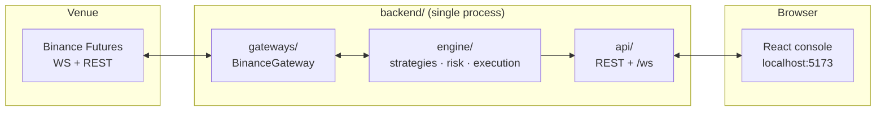
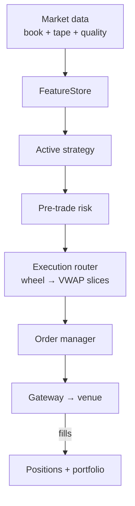
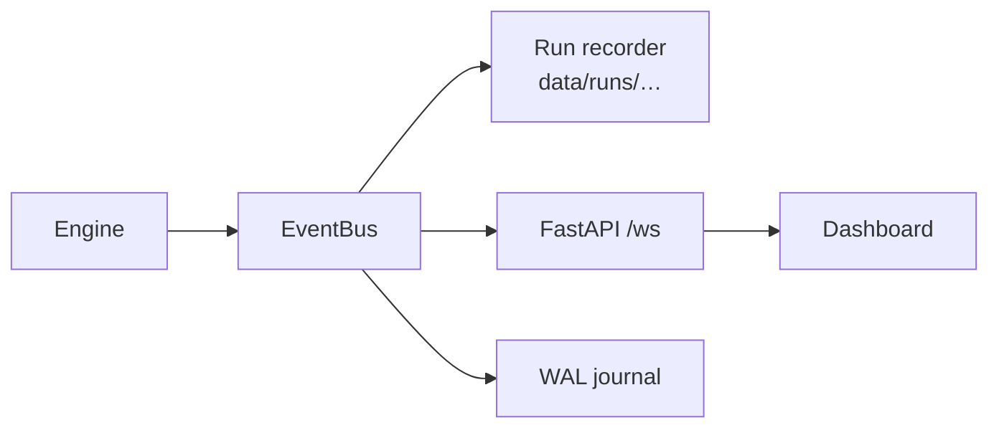

# Algo Trading Hub

A React trading console that observes and controls a Python engine on **Binance USDT-M Futures** (testnet by default). Three strategies ship in-tree — volume-weighted **pairs trading**, multi-symbol **SMA crossover**, and **market making** — and the dashboard hot-swaps between them at runtime (`POST /api/control/strategy`) without restarting the process. The engine is **strategy-agnostic**: new `StrategyBase` plug-ins appear in the toggle automatically — no frontend changes required. You can also run **`all`** to tick every registered strategy and net conflicting signals before execution.

| Piece | Stack | Role |
|-------|-------|------|
| Frontend | React + TanStack Start (Vite; Cloudflare Workers SSR) | Dashboard, controls, live charts |
| Backend | Python 3.11+ / FastAPI / asyncio | Trading engine + REST + WebSocket |
| Venue | Binance Futures (testnet default) | Market data, orders, balances |

Full backend documentation: [`backend/README.md`](backend/README.md).

---

## How it fits together

One Python process runs the engine and the API on the same asyncio loop. The browser talks to FastAPI; the engine talks to the venue through a pluggable gateway.



### Trading tick (simplified)

Each heartbeat walks the same path: ingest quotes → compute features → run the **active** strategy → risk gate → slice and route orders → reconcile fills into positions and equity.



### Events & persistence

State changes fan out on an in-process `EventBus`. Subscribers persist a per-run JSONL archive, stream to the UI, and optionally append a WAL for recovery.



Editable diagram sources live in [`backend/docs/`](backend/docs/).

---

## Platform layers

| # | Layer | Paths | Notes |
|---|-------|-------|-------|
| 1 | Platform | `common/`, `persistence/`, `/health`, `/ready` | Config, bus, journaling |
| 2 | Market data | `engine/market_data/` | L2 book, tape, data-quality guards |
| 3 | Execution | `gateways/`, `engine/execution/` | Binance production; IBKR skeleton |
| 4 | OMS | `engine/orders/`, reconcile | Parent/child lifecycle |
| 5 | Risk | `engine/risk/`, `portfolio/`, `position/` | Pre-trade, monitors, circuit breakers |
| 6 | Strategy | `engine/strategies/`, `analytics/` | Live signals + offline calibration |
| 7 | UI & ops | `src/`, `api/` | Console, alerts, run archives |

---

## Repository layout

```
algo-trading-hub/
├── src/                      React dashboard
│   ├── routes/index.tsx      main page
│   ├── hooks/useAlgoStream.ts   REST hydrate + WebSocket
│   ├── lib/api.ts            typed client
│   └── components/algo/
│       └── types.ts          view-model shapes (mirror backend/api/schemas.py)
└── backend/                  Python engine + API
    ├── main.py               engine + uvicorn entrypoint
    ├── engine/               strategy-agnostic core
    ├── gateways/             venue adapters
    ├── api/                  FastAPI routes + /ws
    ├── analytics/            offline calibration jobs
    └── docs/                 architecture diagram sources
```

---

## Prerequisites

- **Node.js 20+** or **Bun 1.2+** for the frontend
- **Python 3.11+** for the backend
- **Binance Futures Testnet** API key + secret — https://testnet.binancefuture.com

---

## Run locally

Use two terminals.

### Backend

**Windows (one-shot):**

```powershell
cd backend
copy .env.example .env
# set BINANCE_API_KEY and BINANCE_API_SECRET (other overrides optional — defaults in backend/common/config.py)
.\run.bat
```

**macOS / Linux:**

```bash
cd backend
python -m venv .venv && source .venv/bin/activate
pip install -r requirements.txt
cp .env.example .env   # add keys; see common/config.py for defaults
python main.py
# → http://127.0.0.1:8000
```

### Frontend

```bash
bun install        # or: npm install
bun run dev        # or: npm run dev
# → http://localhost:5173
```

In dev, Vite proxies `/api` and `/ws` to `http://127.0.0.1:8000` (same-origin, no CORS). Override with `VITE_API_BASE` if the API runs elsewhere.

---

## Dashboard behaviour

The UI **never talks to Binance directly** — it mirrors the engine’s `PositionTracker` and portfolio via REST + WebSocket.

- **Hydrate** — `GET /api/state` on load; strategy labels, paper/live mode, and KPIs come from the backend (nothing hardcoded in the UI). There is **no mock data** wired in dev or prod — mocks live only under `backend/tests/`.
- **Live stream** — `/ws` pushes fills, orders, equity, `position`, logs, `breaker`, and status events.
- **Stay in sync** (`src/hooks/useAlgoStream.ts`):
  - **Every 5 s** — `GET /api/state` refreshes positions, orders, execution, and system health (safety net if WS events were missed).
  - **On WebSocket reconnect** — debounced full trading-state resync from `/api/state`.
  - **While WS is down** — same 5 s poll instead of status-only updates.
  - **On tab focus** — resync when you return to the dashboard tab.
  - **Manual** — the **refresh** control runs a full hydrate (logs, settings, breakers too).
- **Controls** — Start / Pause / Stop / Flatten / Halt, risk slider, and strategy picker call REST; status flows back over the socket. **Flatten** pauses the engine, syncs positions from the venue, closes each leg (market or VWAP per size/spread), waits until the exchange reports flat (or times out), and leaves the engine **paused** — hit **Resume** when you want trading again.
- **Charts** — position candles via `GET /api/klines`.
- **Panels** — OMS, Execution Quality, and System Health (latency, breakers, connection freshness).

Watch **User-data age**, **Order reconcile**, and **Breakers** in System Health. If user-data is stale or `reconcile_mismatch` appears, treat open positions as untrusted until the engine recovers — Binance is ground truth.

Equity is anchored to the venue: wallets are tracked **per asset** (USDT + USDC on Binance Futures) so a partial `ACCOUNT_UPDATE` never wipes an unreported leg. The engine keeps positions aligned via user-data WS, REST reconcile, and self-heal on drift — see [`backend/README.md` — Position & dashboard sync](backend/README.md#position--dashboard-sync).

In **LIVE** mode the backend **refuses to start** if the gateway still points at a sandbox/testnet host, so portfolio cash/equity always seeds from your **real account balance**.

---

## Safety overview

A unified circuit breaker covers the engine end-to-end:

| Stage | What runs |
|-------|-----------|
| **Pre-trade** | `PreTradeValidator` — fat-finger, signal dedup, limit collar, group parity |
| **Matching / reconcile** | Order reconcile vs venue open orders (orphans auto-cancelled by default); position REST reconcile with auto-heal (`RECONCILE_HEAL_ON_MISMATCH`); user-data WS reconnect resync; optional `RECOVER_ON_START` WAL replay |
| **In-flight** | Urgency profiles, passive bid/ask peg, deterministic client order IDs, per-parent slippage abort, submit throttles |
| **Portfolio** | HWM drawdown, daily-loss kill, consecutive-loss streak, execution-quality blowout (`MAJOR`, latched until re-arm) |
| **System** | MD quality (gaps, crossed book, resnapshot), WS/user-data staleness pause, webhook alerts, `/health` + `/ready` |

`MAJOR` breaches automatically flatten + latch; clear via `POST /api/control/breakers/rearm`. `MINOR` breaches auto-resume after cooldown. Dashboard **Halt** → `breakers/trip`; **Kill** → process shutdown (not the trading kill switch).

See [`backend/README.md` — Failsafes](backend/README.md#failsafes--circuit-breaker-matrix) for the full matrix and tunables.

---

## Learn more

| Topic | Where |
|-------|--------|
| Module walk-through, env vars, API contract | [`backend/README.md`](backend/README.md) |
| Position & dashboard sync (engine + UI) | [`backend/README.md` — Position & dashboard sync](backend/README.md#position--dashboard-sync) |
| Code style for contributors | [`backend/AGENTS.md`](backend/AGENTS.md) |
| Diagram sources | [`backend/docs/`](backend/docs/) |
