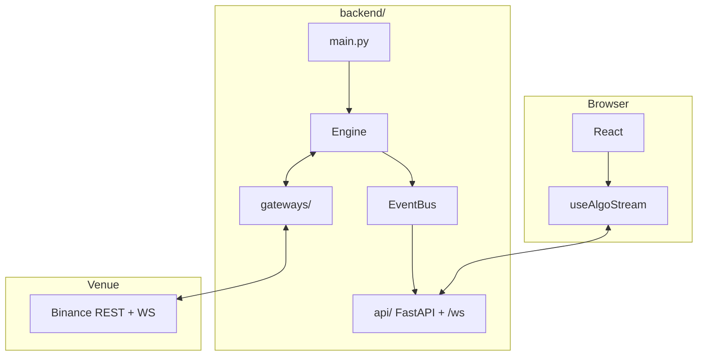
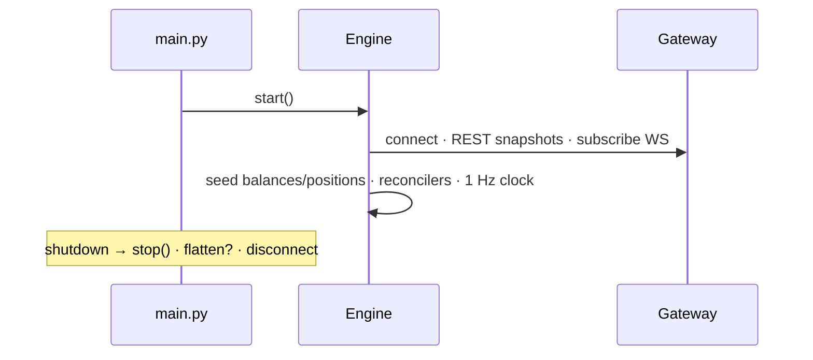
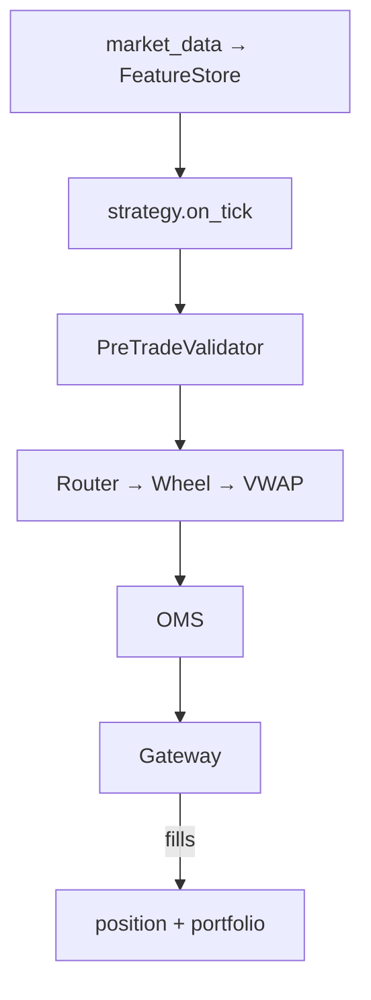
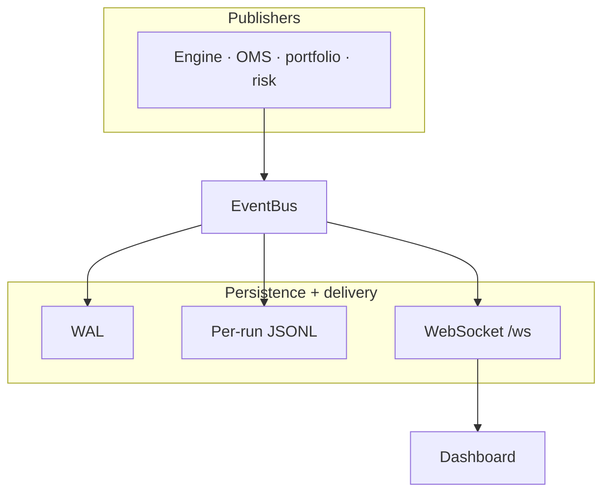
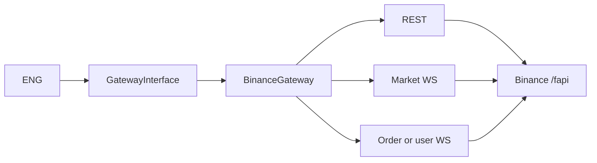
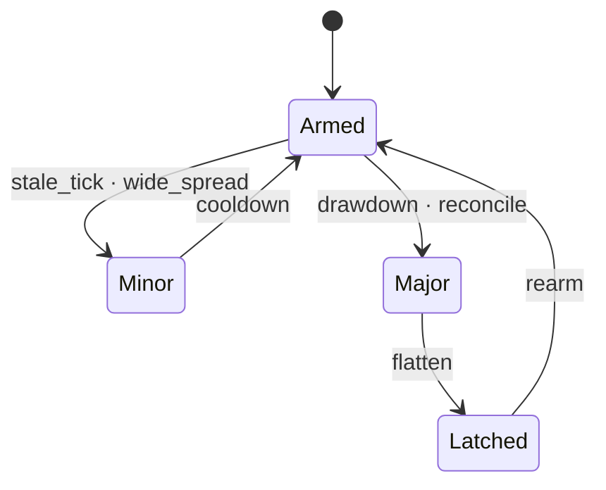
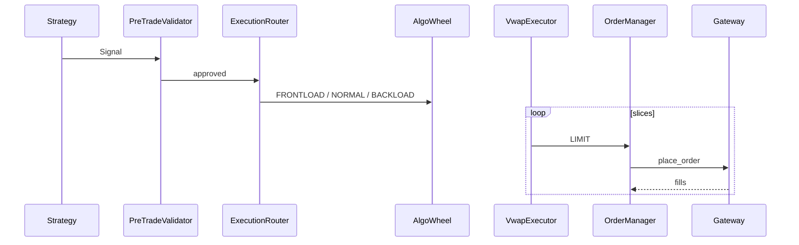
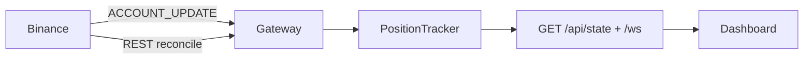

# Algo trading backend

Python backend for the React console at the repo root. Connects to **Binance USDT-M Futures** (testnet by default), runs a VWAP execution wheel (algo wheel → slicer → passive limits + market fallback), and enforces layered risk controls end-to-end.

| Capability | Detail |
|------------|--------|
| **Process model** | Trading: one asyncio loop (`Engine` + FastAPI + `EventBus` in `main.py`). Analytics: supervised worker subprocess for backtest/download (`analytics.worker_main`) |
| **Venue seam** | `GatewayInterface` — Binance production; IBKR skeleton |
| **Strategies** | Pairs (basis z), SMA crossover, institutional market making (quote + microstructure); hot-swap at runtime |
| **Multi-strategy** | `STRATEGY=all` nets signals via `signal_netter` before execution |
| **Persistence** | Per-run JSONL under `data/runs/` + optional WAL replay |
| **API** | REST control + `/ws` stream; schemas mirror `src/components/algo/types.ts` |

Repo overview & audience-specific docs: [`../README.md`](../README.md).  

**Institutional / production docs (repo root `docs/`):** [register](../docs/README.md) · [operations runbook](../docs/OPERATIONS.md) · [security](../docs/SECURITY.md) · [compliance & governance](../docs/COMPLIANCE_AND_GOVERNANCE.md) · [contributor guide](AGENTS.md).

Architecture diagram sources (editable `.mmd`): [`docs/`](docs/) (12 files).

---

## Contents

- [Production documentation (ops, security, compliance)](../docs/README.md)
- [Architecture](#architecture)
- [Module map](#module-map)
- [Quick start](#quick-start)
- [Folder layout](#folder-layout)
- [Trading mode](#trading-mode-paper-vs-live)
- [Adding a gateway](#adding-a-new-gateway)
- [Module deep-dives](#module-deep-dives)
  - [Market making](#strategy--enginestrategiesmarket_makingpy)
  - [Multi-strategy `all`](#multi-strategy-mode--all)
  - [Operator flatten](#operator-flatten-post-apicontrolflatten)
- [Failsafes](#failsafes--circuit-breaker-matrix)
- [Configuration](#configuration-reference)
- [Run archive](#run-archive)
- [REST + WebSocket](#rest--websocket-contract)
- [Testing](#testing)
- [Troubleshooting](#troubleshooting)

---

## Architecture

Read diagrams **top-down**: system context → lifecycle → hot path → events → gateway → data sync → breakers → execution. Every figure has an editable `.mmd` under [`docs/`](docs/) — paste into [mermaid.live](https://mermaid.live) or VS Code to edit.

### Diagram index

| Source file | What it documents |
|-------------|-------------------|
| [`architecture-system.mmd`](docs/architecture-system.mmd) | Venues · single process · control vs data plane |
| [`architecture-lifecycle.mmd`](docs/architecture-lifecycle.mmd) | `main.py` boot · `Engine.start/stop` · WAL · shutdown |
| [`architecture-tick.mmd`](docs/architecture-tick.mmd) | WS callbacks · 1 Hz clock · execution path · background loops |
| [`architecture-events.mmd`](docs/architecture-events.mmd) | EventBus producers/subscribers · JSONL mapping |
| [`architecture-gateway.mmd`](docs/architecture-gateway.mmd) | `GatewayInterface` · Binance connections |
| [`architecture-data-sync.mmd`](docs/architecture-data-sync.mmd) | Venue truth · reconcile · dashboard poll |
| [`architecture-control.mmd`](docs/architecture-control.mmd) | Operator REST → engine |
| [`architecture-frontend.mmd`](docs/architecture-frontend.mmd) | React hydrate + `/ws` (repo `src/`) |
| [`architecture-execution.mmd`](docs/architecture-execution.mmd) | Parent-order sequence |
| [`architecture-strategies.mmd`](docs/architecture-strategies.mmd) | Single vs `all` · signal netting |
| [`architecture-breakers.mmd`](docs/architecture-breakers.mmd) | Breaker state machine |
| [`architecture.mmd`](docs/architecture.mmd) | Compact end-to-end |

### 1. System context

`main.py` builds one `EventBus`, run persistence, `create_gateway(settings)`, all strategies, wires equity providers, optionally `engine.start()`, then uvicorn on the **same asyncio loop**.



### 2. Boot and shutdown



Order inside `Engine.start()`: optional WAL replay → REST book snapshots **before** depth WS → market WS → prime mids → account snapshot → order reconcile → user-data WS → background reconcilers.

`Engine.resume()` (and a successful `POST /api/control/strategy` while **RUNNING**) calls `sync_trading_book_from_rest()` first: merge wallet from `GET /fapi/v2/account`, replace the position tracker from the same snapshot (with `positionRisk` fallback if the account slice is empty while local is not flat), bump venue-truth timestamps, then `OrderReconciler.sync_startup()` when `ORDER_RECONCILE_ON_STARTUP=true`.

### 3. Per-tick trading path

**1 Hz clock:** mark-to-market → connection monitor → breaker tick → risk exits → strategy → pre-trade → router → OMS.

**WS callbacks:** update books/tape; fills and `ACCOUNT_UPDATE` update positions (user-data fresh path avoids double-counting).



**Background (not every tick):** `Reconciler`, `OrderReconciler`, volume refresh, optional balance resync, `LatencyTracker`, `AlertManager`. `ImpactModel` is offline-only (disabled in `TRADING_MODE=live`).

### 4. Events and persistence



| `EventType` | Archive | UI |
|-------------|---------|-----|
| `FILL` | `fills.jsonl` | Trades |
| `ORDER_UPDATE` | `orders.jsonl` | OMS |
| `PARENT_UPDATE` | `parents.jsonl` | In-flight VWAP |
| `EXECUTION_REPORT` | `executions.jsonl` | TCA |
| `POSITION` / `EQUITY` | `positions` / `equity` | Tables · chart |
| `BREAKER` | `breakers.jsonl` | Audit |
| `STATUS` | `status.jsonl` | Health · latency |

Bounded subscriber queues — slow `/ws` clients drop oldest events; state lives in the engine.

### 5. Gateway seam



See [Adding a new gateway](#adding-a-new-gateway). IBKR skeleton: `gateways/ibkr/`.

### 6. Circuit breakers



Reduce-only orders bypass entry breakers. Matrix: [Failsafes](#failsafes--circuit-breaker-matrix).

### 7. Parent-order execution



Wheel rules: [Execution module](#execution-module--engineexecution).

---

## Module map

| Concern | Live path | Offline / calibration |
|---------|-----------|------------------------|
| Analytics | `engine/market_data/` — book, tape, features | `analytics/` — pair + orderbook analyzers |
| Execution | `engine/execution/` + `engine/orders/` | `analytics/orderbook_analyzer.py` → wheel thresholds |
| Risk | `engine/risk/`, `portfolio/`, `position/` | — |
| Gateway | `gateways/` via `create_gateway(VENUE)` | `gateways/ibkr/` skeleton |

Dependency rule: `common/` ← `gateways/` + `engine/` ← `api/` + `analytics/`. Cross-module coupling is only through `EventBus`.

## Quick start

**Windows** — from `backend/`:

```powershell
python -m venv .venv
.\.venv\Scripts\Activate.ps1
pip install -r requirements.txt
copy .env.example .env    # add BINANCE_API_KEY + BINANCE_API_SECRET
python main.py
# or: .\run.bat           # venv + deps + launch in one step
```

**macOS / Linux:**

```bash
python -m venv .venv && source .venv/bin/activate
pip install -r requirements.txt
cp .env.example .env
python main.py
```

API at **http://127.0.0.1:8000** (REST + `/ws`). Frontend in a second terminal from repo root: `npm install && npm run dev` → http://localhost:5173.

By default the engine boots **stopped** — press Start in the UI or `POST /api/control/start`. Auto-start: `ENGINE_AUTOSTART=true` in `.env` or `python main.py --engine`. API-only (engine paused): `python main.py --no-engine`.

## Folder layout

```
backend/
  main.py                    entrypoint: starts engine + FastAPI together
  run.bat                    Windows launcher
  requirements.txt
  pyproject.toml             pytest + ruff config
  README.md                  this file
  AGENTS.md                  engineering conventions (layers, tests, ruff)
  .env.example               minimal env template (defaults live in common/config.py)

  common/                    config (`Settings`), EventBus, enums, shared dataclasses
  gateways/                  abstract venue interface + concrete adapters
    gateway_interface.py     ABC every venue must implement
    factory.py               create_gateway(settings) selects venue by VENUE env var
    binance/                 Binance USDT-M Futures adapter (testnet + mainnet)
      rest_client.py         signed httpx wrapper
      market_connection.py   public WS: bookTicker + aggTrade + depth
      order_connection.py    REST orders + user-data WS
      account_connection.py  balances + positions
      binance_gateway.py     composes the three above
    ibkr/                    Interactive Brokers skeleton (drop-in template)
      ibkr_gateway.py        every method conforms to the interface; TODOs point at ib_async

  engine/                    strategy-agnostic trading core
    core/                    Engine + heartbeat + order/position reconcile + ConnectionMonitor
    market_data/             OrderBook + TradeTape + FeatureStore + data_quality
    observability/           LatencyTracker + AlertManager
    orders/                  OrderManager (parent/child OMS)
    execution/               AlgoWheel + Slicer + VwapExecutor + ExecutionRouter
                             + ImpactModel + ExecutionTracker
    position/                PositionTracker (mark-to-market + realised PnL)
    portfolio/               Portfolio (cash + equity curve)
    risk/                    Limits + PnLTracker + StopLossMonitor + RiskManager
    strategies/              StrategyBase + pairs · sma · market_making
    performance/             PerformanceTracker (win rate, profit factor, trade history)
    persistence/             EventRecorder (per-run JSONL archive of the EventBus)
    main_engine.py           CLI to run the engine without the API

  analytics/                 offline calibration jobs
    data_loader.py           pulls klines into data/*.parquet
    pair_analyzer.py         z-score + cointegration + half-life
    orderbook_analyzer.py    trade-tape distributions for the AlgoWheel
  api/                       FastAPI surface
    server.py                app factory + lifespan + CORS
    schemas.py               Pydantic DTOs that mirror src/components/algo/types.ts
    routes/                  status, positions, trades, orders, execution, logs, control
    ws.py                    /ws WebSocket pump

  tests/                     pytest suite (mocks live ONLY here)
  data/                      gitignored cache of parquet/JSON artefacts
  docs/                      architecture *.mmd (12 diagrams — see Architecture)
```

## Trading mode (paper vs live)

`TRADING_MODE` is a venue-agnostic safety flag, separate from any per-venue testnet/live toggle. It's the *only* knob you should flip to graduate from a sandbox account to real money. Consequences wired into the engine include startup banners and logging strictness:

| `TRADING_MODE`    | Startup banner               |
| ----------------- | ---------------------------- |
| `paper` (default) | one-line INFO line           |
| `live`            | hard-to-miss WARN banner     |

PnL and TCA use **exchange-reported** fill prices (including partial fills). Post-trade quality uses arrival mid vs VWAP of venue fills (`slippage_bps`).

**Dashboard win rate / profit factor** roll up *realized closes*: slice P&amp;L from each reducing fill (Binance `ORDER_TRADE_UPDATE.rp` when authoritative — see `fill_classification.classify_fill`; otherwise **(exit − entry) × closed qty**). Fills tied to the same **parent order** are buffered and counted as **one** close when that parent completes, so VWAP partial exits do not inflate loss counts. **RECENT TRADES** still lists every venue fill. Win-rate KPIs are **not** wallet/equity change (commissions, funding, transfers excluded). **Profit factor** = sum of dollar wins on closes ÷ sum of dollar losses on closes.

When you flip to LIVE you also need to point the gateway at its live endpoints:

- Binance: set `BINANCE_TESTNET=false` and switch `BINANCE_REST_BASE` / `BINANCE_WS_BASE` to mainnet hosts.
- IBKR: set `IBKR_PORT=7496` (TWS / IB Gateway live port).

In **LIVE** mode the gateway **fails fast** if you accidentally point at a sandbox (e.g. `TRADING_MODE=live` but `BINANCE_TESTNET=true`, or `IBKR_PORT=7497`). This guarantees the portfolio is seeded from your **real account balance** rather than a user-controlled/demo balance.

## Adding a new gateway

The engine never imports a venue. It calls `create_gateway(settings)` from `gateways/factory.py` and gets back something that satisfies `GatewayInterface`. Adding a new venue is three steps:

1. **Build the adapter.** Create `gateways/<venue>/<venue>_gateway.py` with a class that extends `GatewayInterface` and implements every abstract method:

   | Method                   | Purpose                                                           |
   | ------------------------ | ----------------------------------------------------------------- |
   | `connect / disconnect`   | open/close the venue connection (REST + WS)                       |
   | `subscribe_market_data`  | ticks + L2 depth + tape + optional WS 24h volumes (`on_quote_volume_24h`) |
   | `subscribe_user_data`    | wire fills + order updates into the engine callbacks              |
   | `place_order`            | translate a `ChildOrder` into a venue order; return with `venue_order_id` |
   | `cancel_order`           | cancel by `client_order_id`                                       |
   | `fetch_positions`        | `list[Position]` snapshot (in `Settings.base_currency`)           |
   | `fetch_balance`          | wallet balance in `Settings.base_currency`                        |
   | `fetch_balances`         | per-asset wallet map (`{"USDT": 100.0, "USDC": 50.0, ...}`); default sums to `fetch_balance` |
   | `fetch_balances_and_positions` | wallet map + positions in minimal REST calls; default chains `fetch_balances` + `fetch_positions`; Binance uses one `GET /fapi/v2/account` |
   | `fetch_24h_volumes`      | per-symbol 24h notional volume (used by liquidity-weighted strategies); default `{}` |
   | `book_snapshot`          | REST L2 snapshot in `{lastUpdateId, bids, asks}` shape            |

2. **Register it.** Add a one-liner to `_REGISTRY` in `gateways/factory.py`:

   ```python
   _REGISTRY = {
       "binance": _build_binance,
       "ibkr": _build_ibkr,
       "<venue>": _build_<venue>,   # <- here
   }
   ```

3. **Configure it.** Add the new venue's connection knobs to `Settings` (e.g. `IBKR_HOST` / `IBKR_PORT` already there for IBKR), then set `VENUE=<venue>` in `.env`.

`gateways/ibkr/ibkr_gateway.py` is a complete skeleton you can copy from — every method conforms to the interface and includes a TODO pointing at the matching `ib_async` (or `ib_insync`) call. `python -m pytest tests/test_gateway_factory.py -q` exercises both the Binance path and the IBKR skeleton against the same `GatewayInterface` to keep the contract honest.

## Module deep-dives

### Analytical module — `analytics/` + `engine/market_data/`

Live, hot-path microstructure features:

- `engine/market_data/orderbook.py` — incremental L2 book (snapshot + diff). Exposes `imbalance(top_n)`, `micro_price`, `spread_bps`.
- `engine/market_data/trade_tape.py` — `window_sec`-rolling tape. Classifies each trade as bid-hit (sell-init) or ask-hit (buy-init) using Binance's `m` flag and computes the ratio fed to the AlgoWheel.
- `engine/market_data/feature_store.py` — read-through `Features` snapshot, the only object strategies see.
- `engine/market_data/data_quality.py` — depth sequence validation (apply-after-snapshot), crossed-book detection (`bid > ask` only), bulk resnapshot on WS reconnect.
- `gateways/binance/market_connection.py` — shards `!ticker@arr` separately from per-symbol streams; relaxed WS keepalive; parallel ticker volume dispatch.

**Stale-tick handling:** `bookTicker` only fires when the BBO changes, so illiquid symbols can look “stale” while quotes are still valid. The engine refreshes tick timestamps from L2 depth and from the synced order book each heartbeat for the active strategy universe, which avoids false `stale_tick` vetoes without masking a dead feed.

Offline calibration (in `analytics/`):

```bash
python -m analytics.data_loader --symbols BTCUSDT,BTCUSDC --interval 1m --days 7
python -m analytics.data_loader --symbols AUTO --interval 1m --days 7
python -m analytics.pair_analyzer --base BTC --interval 1m --window 60
python -m analytics.orderbook_analyzer --symbol BTCUSDT --window-sec 300
# MM: ingest L2 → calibrate starting half-spreads per symbol (then engine loads JSON at boot)
python -m analytics.mm_spread_pipeline --from-mm-symbols --minutes 15 --interval-sec 1
# Or step-by-step:
python -m analytics.l2_loader --symbols BTCUSDT,ETHUSDT,DOGEUSDT --minutes 15
python -m analytics.spread_calibrator --symbols BTCUSDT,ETHUSDT,DOGEUSDT
```

`pair_analyzer` writes `data/pair_<base>.json` (spread mean / std, half-life, Engle-Granger p-value, suggested entry/exit z). `orderbook_analyzer` writes `data/orderbook_<symbol>.json` (taker-buy-share percentiles used to set the wheel's `hit_ratio_threshold`).

**MM spread calibration:** `l2_loader` samples REST depth into `data/l2/{SYMBOL}_l2.parquet`. `spread_calibrator` computes per-symbol `suggested_half_spread_bps` from observed L2 spreads and writes `data/mm_spread_calibration.json`. At runtime, `MM_SPREAD_CALIBRATION_PATH` seeds starting quotes (unless overridden by `MM_SYMBOL_HALF_SPREAD_BPS`); live `MM_QUOTE_USE_VENUE_SPREAD_FLOOR` and inventory skew continue adjusting from there.

### Execution module — `engine/execution/`

See [Parent-order execution](#parent-order-execution-sequence) above for the sequence diagram.

Wheel decision rule (mirrors `engine/execution/algo_wheel.py`):

- **BUY** + bid-imbalance > +T + ask-hit ratio > 0.6 → `FRONTLOAD` (book leaning long, buyers aggressive)
- **BUY** + ask-imbalance > +T + bid-hit ratio > 0.6 → `BACKLOAD` (sellers stacked, let it bleed lower)
- **SELL** is the symmetric mirror
- otherwise → `NORMAL`

Slicer weights are uniform for `NORMAL`, exponential decay for `FRONTLOAD`, reverse exponential for `BACKLOAD`. Total qty is conserved exactly — rounding drift folds into the last child.

#### Optional square-root impact helper

`engine/execution/impact_model.py` implements a textbook square-root calibration for offline experiments only; the production `Engine` does **not** adjust fill prices. Metrics use venue executions as-is.

#### Execution-quality tracking

`engine/execution/execution_metrics.py` (`ExecutionTracker`) captures per-parent stats across the whole order lifecycle:

| Metric          | Definition                                                    |
| --------------- | ------------------------------------------------------------- |
| `arrival_price` | Mid at the moment `ExecutionRouter.submit` is called          |
| `vwap_price`    | Volume-weighted average of all child fills (uses venue price) |
| `slippage_bps`  | `(vwap - arrival) / arrival * 10000 * sign(side)` — positive = adverse |
| `impact_bps`    | retained as zero (API compatibility); use `slippage_bps` for TCA       |
| `fill_ratio`    | `filled_qty / requested_qty`                                  |
| `duration_sec`  | Submit → final fill                                           |

Reports stream live on `EventType.PARENT_UPDATE` and `EventType.EXECUTION_REPORT`, and aggregate stats are exposed at `GET /api/execution`. The dashboard's "Execution Quality" panel renders the rolling 100-parent history.

A parent is moved from the open set to history when *any* of: (a) `fill_ratio` reaches 1.0, (b) `ExecutionRouter.cancel` is invoked, or (c) the `VwapExecutor` run task terminates — including the slice-rejected and partial-fill cases. The last condition is wired via `VwapExecutor(on_parent_done=tracker.close_parent)` and prevents failed parents from accumulating in the OMS panel.

### Strategy — `engine/strategies/pairs_trading.py`

Binance Futures Testnet has no tradable USDT/USDC perp, so we *imply* the stablecoin basis from every coin quoted in both stables (BTC, ETH, SOL, ...):

```
BTC = BTCUSDT * USDT = BTCUSDC * USDC
=> USDT/USDC = BTCUSDC / BTCUSDT
=> basis_i = log(coinUSDC.mid) - log(coinUSDT.mid)   for each coin i
```

`basis_i` is the per-coin implied log(USDT/USDC). Pooling across all configured pairs gives a consensus rate that captures the *actual* stablecoin direction the user wants to track. We weight the consensus by per-symbol 24h notional volume: by default the public WebSocket `!ticker@arr` stream updates `quoteVolume` live (no REST), and the refresh loop only calls `fetch_24h_volumes` to backfill symbols that have not arrived yet.

```
w_i         = volume(coinUSDT) + volume(coinUSDC) + 1.0   # +1 floor keeps cold-start pairs in
reference   = SUM_i (w_i * basis_i) / SUM_i w_i
deviation_i = basis_i - reference
z_i         = (deviation_i - rolling_mean(deviation_i)) / rolling_std
```

When the volume cache is empty (boot, REST hiccup) the `+1.0` floor collapses to equal weights, so cold-start behaviour matches the unweighted strategy.

Trade rule per coin:

- `z_i >= +entry_z` (default `2.0`) → USDC leg unusually rich → **SHORT coinUSDC, LONG coinUSDT**
- `z_i <= -entry_z`                  → USDT leg unusually rich → **LONG  coinUSDC, SHORT coinUSDT**
- `|z_i| <= exit_z` (default `0.5`)  → **take profit** on convergence
- `|z_i| >= stop_z` (default `4.0`) against the open direction → **stop loss** on basis divergence

The pair's risk lives in basis-spread space, not in either leg's absolute price move. A normal correlated tick (both coins drop 0.5%) leaves the basis untouched and the trade healthy, so the strategy bypasses the engine's per-leg fixed-% `StopLossMonitor` (`StrategyBase.manages_own_risk()` returns True) and is responsible for emitting its own SL/TP exits — both keyed off `z`. Portfolio-level safeguards (drawdown kill-switch, gross/per-trade notional caps) still apply.

This is more robust than naively trading `BTCUSDT - BTCUSDC` because a real USDT/USDC move (which lifts the basis on every coin) is absorbed by the reference mean instead of triggering false entries.

`PairsTradingStrategy.reference_basis()` exposes the live consensus for offline calibration.

#### Sizing — stop-loss-budgeted, leverage-enabled, atomically paired

Futures pair-trading needs three things the spot version doesn't:

1. **Hybrid stop-loss-budgeted sizing** — the strategy reads live `equity`
   (via an injected provider) and sizes each leg using `DEFAULT_STOP_LOSS_PCT`
   as a conservative *budget proxy* for the worst-case per-leg adverse move,
   then scales by `|z|/entry_z` so bigger conviction = bigger size:

   ```
   floor_notional = (equity * RISK_PER_TRADE_PCT) / DEFAULT_STOP_LOSS_PCT
   scale          = clamp(|z|/entry_z, 1.0, PAIR_SIZE_SCALE_CAP)
   leg_qty        = scale * floor_notional / max(usdt_mid, usdc_mid)
   ```

   At `|z| == entry_z` we trade the floor (1.0x); at `|z| == 2 * entry_z`
   we trade 2.0x; anything beyond `PAIR_SIZE_SCALE_CAP` (default `2.0`)
   stays clamped so a transient z-spike can't blow up the leg notional.
   Both legs share `leg_qty` so the trade is dollar-neutral, and the
   opening qty is remembered per group so the unwind flattens *exactly*
   what was opened.

   Note: `DEFAULT_STOP_LOSS_PCT` is reused here purely as the sizing
   denominator; the *trigger* that closes the trade is `PAIR_STOP_Z`
   (basis divergence in z-space), not a per-leg fixed-% bracket.

2. **Leverage** — `LEVERAGE` is applied per symbol via the gateway's
   `set_leverage` hook immediately before the first *entry* order for
   that symbol (reduce-only exits skip it). Leverage doesn't change the
   dollar-loss-at-stop (that's bounded by `RISK_PER_TRADE_PCT`); it
   only relaxes the margin requirement so a stop-loss-sized notional
   actually fits inside the wallet. On Binance USDT-M Futures this
   issues `POST /fapi/v1/leverage` at most once per traded symbol per session.

3. **Atomic pair submission** — every paired entry/exit emits both
   legs with the same `Signal.group_id`. `Engine._dispatch_group`
   bumps the qty up to whichever leg has the strictest venue floor
   (so `MIN_NOTIONAL` for the more expensive USDC leg can't reject
   one side), runs the risk gate against *every* leg, and either
   submits all legs at the agreed qty or rejects the whole group.
   You never end up with a "naked" leg because one side cleared a
   filter the other failed.

### Strategy — `engine/strategies/sma_crossover.py`

A multi-symbol fast/slow simple-moving-average crossover scanner. Whenever the fast SMA crosses above the slow SMA on coin X we go long X; when it flips back below we flip short. Each symbol carries its own deque of mids and its own cooldown so a flap on BTC never interferes with an ETH crossover.

Universe is configured via `SMA_SYMBOLS` (CSV or `AUTO` to pull every USDT perpetual on the venue) — the legacy single-symbol `SMA_SYMBOL` is honoured as a fallback when `SMA_SYMBOLS` is empty.

Sizing is equity-budgeted: each entry risks `SMA_RISK_PER_TRADE_PCT` of equity, sized via `DEFAULT_STOP_LOSS_PCT` so a stop-out costs the same dollar amount regardless of price. A static `SMA_QTY` fallback is used while equity is unavailable (boot, REST hiccup) so the strategy can still smoke-test the OMS.

Unlike pairs trading, the SMA strategy does **not** manage its own SL/TP — `manages_own_risk()` returns False so the engine's per-leg `StopLossMonitor` stays armed for every coin it trades. Strategy hot-swap (`POST /api/control/strategy { name: "sma_crossover" }`) atomically rotates the externally-managed set: pairs symbols stop bypassing the bracket and SMA symbols pick up a fresh per-leg stop on the next tick.

With `SMA_BAR_INTERVAL_SEC=0` (default), windows count **engine ticks** (~1 Hz), not minutes — set e.g. `300` for 5-minute bars if you want intraday-style SMAs.

### Strategy — `engine/strategies/blended_signals.py`

Multi-indicator ensemble for single-leg crypto: **EMA trend**, **MACD momentum**, **RSI zone vote** (with overbought/oversold entry blocks), **Bollinger %B** mean-reversion at band extremes, and **microstructure** (imbalance + tape). Component votes in `{-1,0,+1}` are weighted into a blend score in `[-1,+1]`.

- **Entries:** edge-triggered threshold cross (`BLEND_ENTRY_THRESHOLD`) plus `BLEND_MIN_CONFIRMING_VOTES` (default 3 of 5 families must agree). Trend (EMA/MACD) and mean-reversion (BB) can disagree by design — the vote gate keeps signals sparse.
- **Exits:** blend weakens below `BLEND_EXIT_THRESHOLD` while positioned, or opposing cross via `plan_directional_signal`.
- **Samples:** `BLEND_BAR_INTERVAL_SEC` (default 300s closed bars) or tick mode when `0`.
- **Universe:** `BLEND_SYMBOLS` (CSV or `AUTO` / empty for top-N USDT perps by 24h volume, capped by `BLEND_MAX_SYMBOLS`, default 10).
- **Sizing / risk:** same equity-budget pattern as SMA (`BLEND_RISK_PER_TRADE_PCT` split across `BLEND_SYMBOLS`); engine per-leg SL/TP stays armed (`manages_own_risk()` is False).

### Strategy — `engine/strategies/market_making.py` (+ `market_making_v2.py`)

Institutional **two-sided market making** posts standing post-only bid/ask quotes via `QuoteExecutor` — **not** the VWAP wheel. Alpha strategies (`pairs_trading`, `sma_crossover`, `blended_signals`) still route `Signal` → `ExecutionRouter` → `VwapExecutor`.

| Path | Execution |
|------|-----------|
| `market_making`, `market_making_v2` | `QuoteIntent` → `QuoteExecutor` (cancel/replace LIMIT children, parent id `Q-{symbol}-…`) |
| Alpha + operator flatten (non-MM) | VWAP / market slicer |

**Microstructure** (`engine/market_data/microstructure_hub.py`): mid-return jump latch, extended `TradeTape` (VPIN, velocity, large-trade share), effective book depth minus own quotes (`BookDepletionTracker`), post-fill markouts (`MarkoutTracker`), composite toxicity (`ToxicityScorer`). Snapshots land in `FeatureStore` / `Features` for quoting.

**Shared quote logic** (`engine/strategies/mm_core.py`): inventory skew and hard caps, toxicity/jump/depletion gates, asymmetric half-spread widening, tape pressure tilt, profit-aware exits (`mm_scratch_loss_bps`, `mm_min_exit_profit_bps`, `mm_max_hold_sec`). **Own book** (`own_quote_book.py`) tracks resting MM levels and entry ledger; level fills trigger immediate re-quote in the engine.

**Risk:** When `MM_INSTITUTIONAL_RISK_ENABLED=true` (default), strategies set `manages_own_risk()` and symbols are excluded from fixed-% `StopLossMonitor` brackets. `MmFlowGuard` trips symbol breakers on price jump, toxic flow, and book depletion (`price_jump`, `toxic_flow`, `book_depleted`).

**Pricing loop (each 1 Hz tick):**

1. **Venue mid** — L2 mid from `OrderBookStore`.
2. **MM reservation mid** — `reservation = venue_mid × (1 + (micro_bps + inventory_bps) / 10_000)` where `micro_bps` blends skew / imbalance / tape / depletion and `inventory_bps = -inventory_ratio × MM_RESERVATION_INVENTORY_BPS` (long inventory pushes fair mid **down** so you sell more aggressively).
3. **Half-spreads** — base `MM_QUOTE_HALF_SPREAD_BPS` + toxicity/depletion widen; **asymmetric** via `MM_INVENTORY_SPREAD_SKEW_BPS` (widen bid / tighten ask when long).
4. **Limit prices** — `bid = reservation × (1 - bid_half/10k)`, `ask = reservation × (1 + ask_half/10k)`.
5. **Inventory** — `inventory_ratio = signed_notional / cap` (position ± working quotes if enabled); size damps on crowded side; hard ratio pulls that side entirely.

Live logs emit `venue=`, `res=`, `inv=`, `pnl_bps=` on each quote refresh (SIG level).

**Per-symbol spreads:** Run `python -m analytics.mm_spread_pipeline` to ingest L2 and write `data/mm_spread_calibration.json` (loaded via `MM_SPREAD_CALIBRATION_PATH`). Manual `MM_SYMBOL_HALF_SPREAD_BPS` overrides win over calibration. Live `MM_QUOTE_USE_VENUE_SPREAD_FLOOR` + inventory skew adjust from that baseline.

**Key settings:** `MM_QUOTE_*`, `MM_RESERVATION_INVENTORY_BPS`, `MM_INVENTORY_SPREAD_SKEW_BPS`, `MM_INVENTORY_*`, `MM_JUMP_*`, `MM_DEPLETION_*`, `MM_TOXICITY_THRESHOLD`. `MM_SKEW_*` / `MM_TAPE_*` feed the micro shift into reservation mid.

`market_making_v2` adds fee-aware spread floor (`MM2_MIN_SPREAD_BPS`) and cancels quotes when skew is below `MM2_MIN_SKEW_BPS` (same pull pattern as the spread gate). Hot-swap: `POST /api/control/strategy { "name": "market_making" }`.

Pair **exits** (`pairs_close` / `pairs_stop`) emit `reduce_only=True` on both legs so kill-switch / entry breakers do not block basis unwinds.

### Multi-strategy mode — `all`

Set boot default `STRATEGY=all` or hot-swap to `all`. Every registered strategy ticks each heartbeat; `engine/strategies/signal_netter.py` nets opposing signals per symbol before the shared risk + execution path. Per-strategy positions are tracked in `engine/position/strategy_ledger.py` when netting is active.

**Caution:** If pairs, SMA, and blend subscribe to the same symbol (e.g. `BTCUSDT`), opposing intents may net to zero or leave unintended exposure. Prefer disjoint symbol universes per alpha strategy, or run MM on a separate symbol set. The engine logs a warning at boot listing overlapping symbols.

### Operator flatten — `POST /api/control/flatten`

Dashboard **Flatten all positions** calls `POST /api/control/flatten`, which runs `_flatten_and_wait_for_flat()`:

1. **Pause** the engine (no new strategy signals).
2. **Cancel** all venue open orders and local working children.
3. **`GET /fapi/v2/positionRisk`** — replace the local position book via `PositionTracker.sync_from_venue()` (drops symbols the venue no longer reports).
4. **Close each open leg** using per-symbol execution mode (see table below).
5. **Poll the venue** until flat or `FLATTEN_TIMEOUT_SEC`, retrying stragglers with **market-only** closes.
6. Leave the engine **paused** — operator must **Resume** to trade again.

| Condition | Close style |
| --------- | ----------- |
| Retry / still open after wait | **Market** reduce-only (immediate) |
| Notional ≤ `FLATTEN_MARKET_MAX_NOTIONAL_USD` (default $250) | **Market** |
| Spread > `FLATTEN_WIDE_SPREAD_BPS` (default 100 bps) | **Market** |
| Large notional + tight spread (≥ `FLATTEN_VWAP_MIN_NOTIONAL_USD`, spread ≤ `FLATTEN_PASSIVE_SPREAD_BPS`) | **Passive VWAP** — `flatten_passive` schedule (`FLATTEN_VWAP_SLICES` / `FLATTEN_VWAP_DURATION_SEC`), limit pegs, market fallback |
| Otherwise | **Aggressive VWAP** — short urgent schedule (`URGENT_*` slices), market fallback |

If VWAP submit is rejected by `SubmitGuard`, the engine falls back to market for that symbol. Binance `-2022` on a **flatten VWAP** parent (`flatten` / `flatten_passive` notes): the executor polls `fetch_positions()`, treats an already-flat symbol as finished (no further slices), or issues **one market reduce-only** for the refreshed residual and ends the slice loop early — avoiding repeated `-2022` spam while other legs catch up. Other reduce-only VWAP legs still abort on `-2022` as before until the flatten loop retries. Loss-tracker updates are suppressed during flatten so partial closes do not immediately re-trip `consecutive_losses` mid-flatten. Fills from emergency flatten parents (`P-flat-*` market clawbacks and router parents with `flatten` / `flatten_passive` notes) are still journaled to the trades table but omit realised PnL so they do not advance the consecutive-loss streak once flatten completes.

`engine.stop()` still uses the same flatten path when `FLATTEN_ON_STOP=true`.

### Risk module — `engine/risk/` + `engine/portfolio/` + `engine/position/`

Pre-trade gate (`PreTradeValidator` → `RiskManager.check`): single entry for single-leg and pair-group signals. Caps signal qty at `max_risk_pct` of equity, rejects on `max_gross_notional` breach, and applies optional fat-finger limits (`MAX_ORDER_NOTIONAL_USD`, `MAX_QTY_VS_POSITION_MULTIPLE`), signal dedup (`SIGNAL_DEDUP_TTL_SEC`), and venue limits via `venue_sizing` (`venue_min_qty` floor, `venue_cap_qty` ceiling from Binance `LOT_SIZE` / `MARKET_LOT_SIZE` `maxQty`). Additional vetoes flow through `MarketDataGuard` (stale tick; wide spread) and `ExposureTracker` (per-symbol notional cap, free-margin floor). Pair groups use the same per-leg `RiskManager.check` path; partial basket failure triggers compensating reduce-only unwinds.

Order-level reconcile (`engine/core/order_reconciliation.py`) compares venue `openOrders` to OMS working children on the same cadence as position reconcile. When `RECONCILE_CANCEL_ORPHANS=true` (default), venue-only orphans are cancelled and the `order_reconcile_mismatch` breaker is cleared once the books match. Children that look “local-only” because user-data lag left them **working** while they no longer appear on `openOrders` are refreshed via Binance `GET /fapi/v1/order` (`fetch_order_by_client_id`) so fills/cancels merge before any mismatch is counted; remaining drift still trips minor `order_reconcile_mismatch`.

Execution urgency: `Signal.score` ≥ `URGENT_SCORE_THRESHOLD` or reduce-only exits use shorter VWAP schedules (`URGENT_DURATION_SEC`, `URGENT_NUM_SLICES`, `URGENT_MAX_SLIPPAGE_BPS`). Passive LIMIT slices peg to best bid/ask with `MAX_LIMIT_DEVIATION_BPS` collar. Child `clientOrderId` values are deterministic per parent slice for safe retries.

Journal: when `JOURNAL_ENABLED=true`, every bus event is appended to `events.wal.jsonl` with monotonic `seq` and `meta.json` checkpoint. Set `RECOVER_ON_START=true` to replay the previous run WAL into OMS/positions before venue reconcile on boot. Latency histograms (`tick_to_submit_ms`, etc.) emit on `EventType.STATUS` every `LATENCY_METRICS_INTERVAL_SEC`. Market-data quality (`engine/market_data/data_quality.py`) tracks sequence gaps and crossed books. `AlertManager` can POST to `ALERT_WEBHOOK_URL` on MAJOR breakers and reconcile mismatches. `GET /health` and `GET /ready` expose process and engine readiness. `GET /api/reports/latest` summarizes the latest run archive.

Live monitor (`RiskManager.monitor_tick`): per tick, evaluates the position's `StopBracket` (configured from `default_stop_loss_pct` / `default_take_profit_pct`) and emits an `ExitIntent` when the bid/ask crosses a threshold. A drawdown breach trips the kill switch and flattens. A separate high-water-mark drawdown (`hwm_drawdown_kill_pct`) catches the give-back-from-peak scenario the session-start drawdown can miss.

Symbols owned by a strategy whose `manages_own_risk()` returns True (e.g. pairs trading) are listed in `StopLossMonitor.externally_managed` and bypass per-leg fixed-% brackets entirely — `arm()` is a no-op and `evaluate()` always returns None for those symbols. The strategy is then solely responsible for emitting SL/TP signals in its own risk space (z-score basis divergence/convergence for pairs). Portfolio-level safeguards (drawdown kill-switch, per-trade and gross notional caps) still apply via `RiskManager`.

Risk-driven exits (SL, TP, max-drawdown, operator flatten) are submitted with `reduce_only=True` so the venue waives MIN_NOTIONAL — a sub-$50 BTCUSDT position can still close cleanly on Binance Futures testnet, where naked orders below the notional floor are rejected with code `-4164`. The slicer mirrors the waiver: `_slice_satisfies` skips MIN_NOTIONAL for reduce-only parents. To prevent the 1 Hz clock from re-emitting the same exit while a closing order is in flight, `StopLossMonitor` applies a per-symbol cooldown (default 5 s). A re-arm caused by a *scale-in* fill (position grew or flipped sign) clears the cooldown so a fresh bracket can fire immediately; a re-arm caused by a *closing* fill (position shrunk) preserves the cooldown so the SL doesn't cascade duplicate exits while the in-flight closer is still working.

`PositionTracker` folds fills into a per-symbol weighted-entry position, splits realised PnL on partial closes, and handles flips (short → long) cleanly. A venue-side close (`pa==0` row in `ACCOUNT_UPDATE`) pops the symbol so the dashboard never holds a stale long.

`Portfolio` sits on top: cash + positions + equity curve, all read by the dashboard. Cash is held as a per-asset wallet map (`{"USDT": 100.0, "USDC": 50.0, ...}`) so a partial `ACCOUNT_UPDATE` event — Binance only ships the assets that *changed* — merges cleanly without zeroing out unreported wallets. The single-number `cash` view sums the USDT + USDC stablecoin wallets when `BASE_CURRENCY` is one of them. Wallet and position figures are applied live from the user-data WebSocket (`ACCOUNT_UPDATE`). Periodic reconcile uses REST only when user-data has been idle longer than `RECONCILE_USER_DATA_FRESH_SEC` (or when `RECONCILE_SKIP_REST_WHEN_USER_DATA_FRESH=false`). On Binance USDT-M that is a single `GET /fapi/v2/account` (balances plus embedded `positions`), which matches Binance’s guidance to prefer the stream over polling and halves reconcile weight versus two endpoints. Optional `BALANCE_RESYNC_SEC` > 0 adds another GET `/account` loop (default `0`).

### Position & dashboard sync

Binance is the source of truth for open qty. The engine and dashboard are kept aligned through stacked layers:

| Layer | When | What happens |
| ----- | ---- | ------------ |
| **Startup REST** | `engine.connect()` | One `fetch_balances_and_positions()` seeds portfolio + `PositionTracker` before user-data WS subscribes. |
| **User-data WS** | Every `ACCOUNT_UPDATE` | `apply_exchange_positions()` merges changed symbols; `pa==0` rows pop stale symbols. While user-data is fresh, fill handlers skip `on_fill()` so qty is not doubled when events arrive out of order. |
| **User-data reconnect** | Binance user WS reconnects | `Engine._on_user_ws_connected()` pulls REST again and `sync_from_venue()` so missed events while the socket was down do not leave ghost positions. |
| **Periodic reconcile** | Every `RECONCILE_INTERVAL_SEC` when user-data idle | `Reconciler` diffs local qty vs REST; on mismatch, optionally **heals** local from venue (`RECONCILE_HEAL_ON_MISMATCH`, default `true`) and still trips MAJOR `reconcile_mismatch` so operators are alerted. |
| **Order reconcile** | Same cadence + startup | Compares venue `openOrders` to OMS working children (`ORDER_RECONCILE_ON_STARTUP`). |
| **Dashboard poll** | Every 5 s + WS reconnect + tab focus | `useAlgoStream` calls `GET /api/state` so the React table matches `engine.snapshot().positions` even if incremental WS events were missed. |



**Editable source:** [`docs/architecture-data-sync.mmd`](docs/architecture-data-sync.mmd)

**Operator signals** (System Health panel): keep **venue sync age** (`user_data_age_sec`: last user-data WS event *or* successful periodic REST account snapshot) sane; **`user_ws_event_age_sec`** can grow while you hold exposure without fills — rely on reconcile + **`user_data_reconcile_stale`** only when truth is old. **Order reconcile** should read OK; any **`reconcile_mismatch` breaker** means drift was detected (and healed if `RECONCILE_HEAL_ON_MISMATCH=true`) — investigate before resuming. Set `RECONCILE_SKIP_REST_WHEN_USER_DATA_FRESH=false` if you want REST position checks every reconcile interval even while user-data WS is active.

### Failsafes — circuit-breaker matrix

Every safety trip flows through one shared `CircuitBreaker` (`engine/risk/circuit_breaker.py`). Each breach has a **scope** (`engine` | `symbol` | `parent`), a **severity** (`minor` auto-resumes after a cooldown; `major` is latched until operator re-arm), and is fanned out on the EventBus as `EventType.BREAKER` so the React console renders an audit log.

| Code | Severity | Scope | Trip on | Action |
| ---- | -------- | ----- | ------- | ------ |
| `stale_tick` | minor | symbol | tick age > `MAX_TICK_AGE_SEC` | veto entries; auto-resume |
| `wide_spread` | minor | symbol | spread > dynamic threshold (`SPREAD_WIDE_MULTIPLIER` × per-symbol EWMA, clamped by floor/ceiling) or, if `SPREAD_DYNAMIC_ENABLED=false`, spread > `MAX_ENTRY_SPREAD_BPS` | veto entries; auto-resume |
| `repeat_reject` | minor | symbol | `MAX_CONSECUTIVE_REJECTS` rejects in a row | pause symbol for `REJECT_COOLDOWN_SEC` |
| `slippage_breach` | minor | parent | realised vs arrival > `parent.max_slippage_bps` | cancel parent |
| `stale_market_data` | minor | engine | no public WS traffic (bookTicker / depth / aggTrade / `!ticker@arr`) for > `WS_STALE_PAUSE_SEC` | pause new orders |
| `stale_user_data` | minor | engine | user-data silent > `WS_STALE_PAUSE_SEC` | pause new orders |
| `max_drawdown` | major | engine | session-start drawdown >= `MAX_DRAWDOWN_PCT` | flatten + latch |
| `hwm_drawdown` | major | engine | drawdown from peak equity >= `HWM_DRAWDOWN_KILL_PCT` | flatten + latch |
| `daily_loss` | major | engine | equity drop since UTC midnight >= `DAILY_LOSS_KILL_PCT` | flatten + latch |
| `consecutive_losses` | major | engine | `MAX_CONSECUTIVE_LOSSES` qualifying realised losses in a row (`CONSECUTIVE_LOSS_MIN_ABS_USD`) | flatten + latch |
| `exec_quality` | major | engine | rolling avg slippage > `EXEC_QUALITY_KILL_BPS` | flatten + latch |
| `reconcile_mismatch` | major | engine | venue vs local qty diff > `RECONCILE_QTY_TOLERANCE` on REST reconcile (local healed from venue when `RECONCILE_HEAL_ON_MISMATCH=true`) | flatten + latch |
| `order_reconcile_mismatch` | minor | engine | open-order set differs between venue and OMS | pause; auto-resume |
| `group_unwind_failed` | major | symbol | compensating unwind after partial pair submit failed | latch symbol |
| `operator_halt` | major | engine | operator `POST /api/control/breakers/trip` or dashboard **Halt** | flatten + latch |

Pre-submit guards (`SubmitGuard`) enforce three additional ceilings without tripping a recorded breach:

- `MAX_OPEN_PARENTS` — caps simultaneous in-flight parents.
- `SUBMIT_RATE_PER_SEC` — global token-bucket throttle on REST submits, so a runaway loop cannot spam the venue and earn a ban.
- Reduce-only orders bypass both engine- and symbol-scope breakers so flattens / SL exits always reach the venue.

Engine `stop()` market-outs residuals before disconnect when `FLATTEN_ON_STOP=true` (default) via the same flatten path and waits up to `FLATTEN_TIMEOUT_SEC` for the venue to report flat.

Operator endpoints:

```
GET  /api/control/breakers                    # active + history
POST /api/control/breakers/trip               # body: {detail?, flatten?, pause?}; operator halt
POST /api/control/breakers/rearm              # clears latched majors + resets baselines (streak, daily anchor, session/HWM equity, exec TCA history) for removed codes
```

The dashboard **Halt** button calls `breakers/trip` (trading halt + flatten + pause). **Kill** calls `shutdown`: flatten all venue positions, cancel open orders, `Engine.stop()`, then exit the Python process — it is not the same as the periodic reconcile kill-switch.

**Paper / testnet tuning:** breaker state is in-memory only (cleared on restart). Tighten `MAX_DRAWDOWN_PCT`, `HWM_DRAWDOWN_KILL_PCT`, or `DAILY_LOSS_KILL_PCT` in `common/config.py` if you want earlier automatic halts on small paper accounts. `WS_STALE_PAUSE_SEC` trips a MINOR engine breach (pauses entries, no auto-flatten).

### Code structure & quality

See `AGENTS.md`. Highlights:

- One-way dependency graph (`common/` <- `gateways/` + `engine/` <- `api/` + `analytics/`).
- Single in-process `EventBus` (asyncio.Queue fan-out) is the only cross-module coupling.
- All Binance access goes through `gateways/binance/binance_gateway.py` so the engine swaps to a `MockGateway` in tests with zero engine changes (no mocks in dev/prod, only tests).
- File length capped ~250 LOC; modules split by responsibility.

## Configuration reference

Defaults are defined on the `Settings` class in `common/config.py` (single source of truth). Prefer editing that file for risk, spread, and strategy knobs; use `backend/.env` or environment variables mainly for secrets and deployment-specific overrides — `.env.example` stays minimal.

Loaded via `pydantic-settings`. Defaults shown below.

| Key                          | Default                              | Effect |
| ---------------------------- | ------------------------------------ | ------ |
| `VENUE`                      | `binance`                            | Selects the gateway adapter (`binance` \| `ibkr`) |
| `TRADING_MODE`               | `paper`                              | `paper` \| `live`. LIVE force-disables synthetic impact |
| `BINANCE_API_KEY`            | _required when VENUE=binance_        | Futures API key |
| `BINANCE_API_SECRET`         | _required when VENUE=binance_        | Futures API secret |
| `BINANCE_TESTNET`            | `true`                               | Pin to testnet endpoints |
| `BINANCE_REST_BASE`          | `https://testnet.binancefuture.com`  | REST host |
| `BINANCE_WS_BASE`            | `wss://stream.binancefuture.com`     | WS host |
| `BINANCE_REST_MIN_INTERVAL_MS` | `100`                              | Minimum spacing between REST calls (client-side throttle) |
| `BINANCE_REST_429_DEFAULT_BACKOFF_SEC` | `60`                        | HTTP 429 pause when ``Retry-After`` header is absent |
| `BINANCE_REST_PAUSE_BUFFER_SEC` | `0.5`                           | Extra seconds added to ``Retry-After`` / ban backoff |
| `IBKR_HOST` / `IBKR_PORT`    | `127.0.0.1` / `7497`                 | TWS / IB Gateway address (7497 paper, 7496 live) |
| `IBKR_CLIENT_ID`             | `7`                                  | IB API client id |
| `IBKR_ACCOUNT`               | empty                                | Specific account to trade (empty = default) |
| `SYMBOLS`                    | `AUTO`                               | Subscribed symbols. CSV (`BTCUSDT,BTCUSDC,...`) or `AUTO` to auto-discover every USDT/USDC perp pair on the venue at boot |
| `STRATEGY`                   | `pairs`                              | Boot default: `pairs`, `sma_crossover`, `market_making`, or `all` (netted multi-strategy). Hot-swappable via `POST /api/control/strategy` |
| `ENGINE_AUTOSTART`           | `false`                              | Start engine on boot (or use `python main.py --engine`) |
| `BASE_CURRENCY`              | `USDT`                               | Equity / PnL denomination (if `USDT`/`USDC`, the engine sums **USDT+USDC** wallets) |
| `MAX_RISK_PCT`               | `0.35`                               | Per-leg notional ceiling as % of equity (hard cap; UI slider) |
| `RISK_PER_TRADE_PCT`         | `0.005`                              | Stop-loss-budgeted sizing: equity fraction lost if SL fires |
| `LEVERAGE`                   | `10`                                 | Futures leverage target per symbol (applied lazily before first entry); Binance clamps to each symbol's max (`GET /fapi/v1/leverageBracket` then `POST /fapi/v1/leverage`) |
| `LEVERAGE_BRACKET_CACHE_PATH` | `data/cache/binance_leverage_brackets.json` | Backend-relative JSON cache for bracket caps (skip GET after first successful fetch) |
| `LEVERAGE_BRACKET_CACHE_TTL_SEC` | `0`                               | Seconds before refetching brackets (`0` = only refresh when cache missing or `BINANCE_REST_BASE` changes) |
| `MAX_GROSS_NOTIONAL`         | `50000`                              | Hard cap on total open notional |
| `MAX_DRAWDOWN_PCT`           | `0.10`                               | Drawdown that trips the kill switch |
| `DEFAULT_STOP_LOSS_PCT`      | `0.005`                              | Per-position SL distance (also the sizing denominator) |
| `DEFAULT_TAKE_PROFIT_PCT`    | `0.010`                              | Per-position TP distance |
| `PAIR_ENTRY_Z` / `PAIR_EXIT_Z` / `PAIR_STOP_Z` | `2.0` / `0.5` / `4.0`     | Pairs entry / take-profit / stop thresholds in z-space |
| `PAIR_SIZE_SCALE_CAP`        | `2.0`                                | Hybrid sizing ceiling: scale floor by `min(\|z\|/entry_z, cap)` |
| `PRIME_WS_TIMEOUT_SEC`       | `10.0`                               | Boot: wait for `bookTicker` mids this long before REST `/depth` fallback per symbol |
| `PAIR_VOLUME_FROM_WEBSOCKET` | `true`                             | Rolling 24h quote volume from WS `!ticker@arr` instead of REST `/ticker/24hr` |
| `PAIR_VOLUME_REFRESH_SEC`    | `1800`                               | Volume loop period; with WS mode REST only backfills symbols still missing |
| `BALANCE_RESYNC_SEC`         | `0`                                  | Extra GET `/account` cadence (0 = off; balances still refresh on `RECONCILE_INTERVAL_SEC` + WS) |
| `SMA_SYMBOLS`                | `AUTO`                               | Universe for the SMA scanner. CSV or `AUTO` to pull every USDT perp; empty falls back to `SMA_SYMBOL` |
| `SMA_MAX_SYMBOLS`            | `20`                                 | Cap when `SMA_SYMBOLS=AUTO` (top N by 24h volume) |
| `BLEND_SYMBOLS`              | `AUTO`                               | Universe for blended signals. CSV or `AUTO` / empty (top N by 24h volume) |
| `BLEND_MAX_SYMBOLS`          | `10`                                 | Cap when `BLEND_SYMBOLS=AUTO` |
| `MM_SYMBOLS`                 | `AUTO`                               | MM universe (CSV or `AUTO` / empty → `mm_universe_scanner` analytics) |
| `MM_AUTO_MAX_SYMBOLS`        | `12`                                 | Top-N symbols from scan when `MM_SYMBOLS=AUTO` |
| `MM_AUTO_MIN_QUOTE_VOLUME`   | `5000000`                            | Min 24h USDT quote volume for scan candidates |
| `MM_AUTO_STABILITY_PERCENTILE` | `75`                               | P75 of spread CV / mid-vol among candidates sets caps |
| `MM_AUTO_MAX_SPREAD_CV`      | `0` (auto)                           | Override spread-instability cap (0 = derive) |
| `MM_AUTO_MAX_MID_VOL_BPS`    | `0` (auto)                           | Override mid-jitter cap (0 = derive from vol) |
| `MM_UNIVERSE_REFRESH_SEC`    | `3600`                               | Periodic rescan when AUTO (0 = off) |
| `MM_UNIVERSE_ADVERSE_*`      | see config                           | Re-scan when markout/toxic/jump/spread/regime breach |
| `MM_SKEW_WINDOW_SEC`         | `300`                                | Rolling window for micro-price skew average |
| `MM_RISK_PER_TRADE_PCT` / `MM_QTY` / `MM_COOLDOWN_SEC` | `0.005` / `0.001` / `12` | Sizing + per-symbol cooldown |
| `MM_MAX_ENTRIES_PER_TICK`    | `4`                                  | Max new MM entries per 1 Hz tick (by score); exits uncapped |
| `SMA_FAST_WINDOW` / `SMA_SLOW_WINDOW` | `10` / `30`                | Fast / slow SMA windows (sample count; see `SMA_BAR_INTERVAL_SEC`) |
| `SMA_BAR_INTERVAL_SEC`       | `0`                                  | Bar length in seconds for each SMA sample (`0` = one sample per ~1s heartbeat); e.g. `300` = 5m bars |
| `SMA_RISK_PER_TRADE_PCT`     | `0.005`                              | Equity slice per SMA entry (uses `DEFAULT_STOP_LOSS_PCT` as the sizing denominator) |
| `SMA_QTY` / `SMA_COOLDOWN_SEC` | `0.001` / `15`                     | Static fallback qty + per-symbol cooldown |
| `VWAP_DURATION_SEC`          | `60`                                 | Parent-order duration |
| `VWAP_NUM_SLICES`            | `6`                                  | Children per parent |
| `IMBALANCE_TOP_N`            | `10`                                 | L2 levels per side for imbalance |
| `TRADE_TAPE_WINDOW_SEC`      | `300`                                | Rolling window for hit-ratios |
| `API_HOST` / `API_PORT`      | `127.0.0.1` / `8000`                 | FastAPI bind |
| `KLINES_CACHE_TTL_SEC`       | `60.0`                               | Dedupe `GET /api/klines` upstream REST calls within this TTL (seconds) |
| `CORS_ORIGINS`               | `http://localhost:5173,...`          | Allowed origins for the frontend |
| `PERSIST_ENABLED`            | `true`                               | Tee every event into the per-run JSONL archive |
| `PERSIST_DIR`                | `data/runs`                          | Base folder for run archives (relative paths anchored at `backend/`) |
| `PERSIST_RECORD_TICKS`       | `false`                              | Also archive the TICK firehose (very high volume) |
| `LOG_LEVEL`                  | `info`                               | Root log level: `debug`, `info`, `warning`, `error` (console, `app.log`, LIVE LOG) |
| `LOG_FILE_ENABLED`           | `true`                               | Write `app.log` into the run archive |
| `LOG_FILE_MAX_BYTES`         | `10000000`                           | Rotate `app.log` at this size |
| `LOG_FILE_BACKUP_COUNT`      | `5`                                  | Keep N rotated `app.log` backups |
| `MAX_TICK_AGE_SEC`           | `5.0`                                | Stale-tick veto threshold (per symbol) |
| `MAX_ENTRY_SPREAD_BPS`       | `25.0`                               | Wide-spread veto when dynamic spread is off (`spread_dynamic_enabled=false`) |
| `SPREAD_DYNAMIC_ENABLED` / `SPREAD_BASELINE_ALPHA` / `SPREAD_WIDE_MULTIPLIER` / `SPREAD_WIDE_FLOOR_BPS` / `SPREAD_WIDE_CEILING_BPS` | see `Settings` | EWMA spread gate — **edit defaults in `common/config.py`** |
| `MAX_SYMBOL_NOTIONAL_PCT`    | `0.20`                               | Per-symbol exposure cap (fraction of equity) |
| `MIN_FREE_MARGIN_PCT`        | `0.0` (off)                          | Spot-style gross/equity headroom for new exposure; **on futures, `>0` often blocks constantly** because notionals exceed equity — keep `0` unless you tune it deliberately |
| `MAX_OPEN_PARENTS`           | `16`                                 | Cap on simultaneous in-flight parents |
| `SUBMIT_RATE_PER_SEC`        | `5.0`                                | Global REST submit throttle (token bucket) |
| `MAX_CONSECUTIVE_REJECTS`    | `3`                                  | K rejects -> minor symbol pause |
| `REJECT_COOLDOWN_SEC`        | `30.0`                               | Symbol-pause cooldown after repeat rejects |
| `DAILY_LOSS_KILL_PCT`        | `0.05`                               | Equity drop since UTC midnight (MAJOR latch) |
| `MAX_CONSECUTIVE_LOSSES`     | `10`                                 | Losing-trade streak (MAJOR latch); set `MAX_CONSECUTIVE_LOSSES=0` to disable counting |
| `CONSECUTIVE_LOSS_MIN_ABS_USD` | `0` (off)                         | Optional: ignore realised losses smaller than this absolute PnL (quote) toward the streak |
| `HWM_DRAWDOWN_KILL_PCT`      | `0.15`                               | Drawdown from running peak equity (MAJOR latch) |
| `EXEC_QUALITY_KILL_BPS`      | `50.0`                               | Rolling avg slippage blowout (MAJOR latch) |
| `EXEC_QUALITY_WINDOW`        | `10`                                 | Number of completed parents in the avg |
| `WS_STALE_PAUSE_SEC`         | `30.0`                               | Auto-pause threshold for WS / user-data silence |
| `RECONCILE_INTERVAL_SEC`     | `60.0`                               | Reconcile timer; REST snapshot runs only when user-data WS idle (see below) |
| `RECONCILE_SKIP_REST_WHEN_USER_DATA_FRESH` | `true`                  | Skip account REST snapshot while fills / orders / `ACCOUNT_UPDATE` were recent |
| `RECONCILE_USER_DATA_FRESH_SEC` | `120.0`                           | Max age (seconds) for last user-data activity to treat WS as authoritative |
| `RECONCILE_QTY_TOLERANCE`    | `1e-6`                               | Qty mismatch above this trips MAJOR `reconcile_mismatch` |
| `RECONCILE_HEAL_ON_MISMATCH` | `true`                               | Overwrite local positions from venue REST when reconcile finds qty drift (breaker still trips) |
| `RECONCILE_CANCEL_ORPHANS`   | `true`                               | Cancel venue open orders unknown to OMS; clear mismatch when resolved |
| `ORDER_RECONCILE_ON_STARTUP` | `true`                               | Sync OMS vs venue open orders after `connect()` |
| `MAX_ORDER_NOTIONAL_USD`     | `0`                                  | Absolute USD cap per order (0 = disabled) |
| `SIGNAL_DEDUP_TTL_SEC`       | `2.0`                                | Suppress duplicate signals within window |
| `MAX_LIMIT_DEVIATION_BPS`    | `50.0`                               | LIMIT peg collar vs mid |
| `URGENT_SCORE_THRESHOLD`     | `0.85`                               | `Signal.score` at/above → aggressive execution |
| `JOURNAL_ENABLED`            | `true`                               | Append all bus events to `events.wal.jsonl` |
| `RECOVER_ON_START`           | `false`                              | Replay previous run WAL before venue reconcile |
| `LATENCY_METRICS_INTERVAL_SEC` | `5.0`                              | Emit pipeline latency histograms on STATUS |
| `ALERT_WEBHOOK_URL`          | ``                                   | Slack-compatible webhook for critical alerts |
| `ALERT_COOLDOWN_SEC`         | `60.0`                               | Dedup window between identical alerts |
| `POST_ONLY_ENABLED`          | `false`                              | GTX post-only on passive LIMIT slices (Binance) |
| `PER_SYMBOL_SUBMIT_RATE`     | `0`                                  | Per-symbol submit throttle (0 = global only) |
| `MD_STALE_RESNAPSHOT_SEC`    | `30.0`                               | Force REST book resnapshot when diffs go stale |
| `API_TOKEN`                  | ``                                   | Bearer token for `/api/control/*` when set |
| `FLATTEN_ON_STOP`            | `true`                               | Flatten residuals before `engine.stop()` disconnects |
| `FLATTEN_TIMEOUT_SEC`        | `30.0`                               | Max wait for venue-flat after `POST /api/control/flatten` |
| `FLATTEN_MARKET_MAX_NOTIONAL_USD` | `250.0`                         | Below this notional, flatten uses market only |
| `FLATTEN_VWAP_MIN_NOTIONAL_USD` | `1500.0`                          | Above this + tight spread → passive VWAP flatten |
| `FLATTEN_PASSIVE_SPREAD_BPS` | `20.0`                               | Max spread for passive VWAP flatten |
| `FLATTEN_WIDE_SPREAD_BPS`    | `100.0`                              | Above this spread → market flatten |
| `FLATTEN_VWAP_DURATION_SEC`  | `18`                                 | Passive flatten VWAP schedule duration |
| `FLATTEN_VWAP_SLICES`        | `4`                                  | Passive flatten VWAP slice count |
| `BREAKER_MINOR_COOLDOWN_SEC` | `60.0`                               | Default cooldown for minor scoped breaches |

## Run archive

Every engine start creates a fresh, timestamped folder under `PERSIST_DIR`:

```
backend/data/runs/2026-05-09T13-30-15Z/
  manifest.json          run id + UTC start + which streams are recorded
  app.log                rotating (10 MB x 5 by default) full-fidelity log
  fills.jsonl            every venue fill (incl. venue_price + impact_bps)
  orders.jsonl           every child order lifecycle update
  parents.jsonl          per-parent progress snapshots
  executions.jsonl       per-parent post-trade reports (slippage, vwap, ...)
  positions.jsonl        every position snapshot change
  equity.jsonl           every mark-to-market equity tick
  status.jsonl           engine status transitions (running/paused/stopped)
  breakers.jsonl         circuit-breaker trips and clears
  logs.jsonl             same INFO+ records the dashboard sees
  events.wal.jsonl       (when JOURNAL_ENABLED=true) full bus WAL
  ticks.jsonl            (only if PERSIST_RECORD_TICKS=true)
```

Each `.jsonl` is one self-contained JSON object per line of the form `{"ts": <epoch>, "type": "<event>", "data": {...}}` — the same shape `/ws` emits, so any downstream parser (pandas, DuckDB, parquet, etc.) can replay a session without re-running live trading.

A typical post-mortem:

```python
import pandas as pd
fills = pd.read_json("backend/data/runs/<run-id>/fills.jsonl", lines=True)
exec_ = pd.read_json("backend/data/runs/<run-id>/executions.jsonl", lines=True)
print(exec_["data"].apply(pd.Series)[["symbol", "slippage_bps", "impact_bps"]].describe())
```

Persistence is opt-out (`PERSIST_ENABLED=false`); the rotating `app.log` is independent (`LOG_FILE_ENABLED=false`) so you can drop one without losing the other.

## Backtesting data (1m klines)

While the engine runs with persistence on, **`CAPTURE_MARKET_BARS=true`** (default) aggregates live mids into 1m OHLCV bars every clock tick. Closed bars are written to:

- `data/runs/<run-id>/market_bars/{SYMBOL}_1m.parquet` (per session)
- `data/klines/{SYMBOL}_1m.parquet` (merged library, deduped by `open_time`)

Optional bulk history (gap-fill before you have enough live data):

```bash
python -m analytics.data_loader --symbols BTCUSDT,ETHUSDT --interval 1m --days 30
```

Manifest: `data/klines/manifest.json` tags each series as `live`, `download`, or `mixed`.

Offline backtest (SMA, blended, pairs — not market-making):

| Method | Path | Body |
| ------ | ---- | ---- |
| GET | `/api/backtest/datasets` | List library entries |
| GET | `/api/backtest/sessions` | Run folders with captured bars |
| POST | `/api/backtest/download` | `{symbols, interval, days}` |
| POST | `/api/backtest/run` | `{strategy, dataset: "library" \| "run:<id>", settings_overrides?}` |
| GET | `/api/backtest/runs` | Saved result summaries |
| GET | `/api/backtest/runs/{id}` | Full result JSON |

Dashboard: **Backtest** tab at `/backtesting` (link in the live console top bar).

Limitations: 1m bars approximate live microstructure; fills are simulated at mid ± `BACKTEST_SLIPPAGE_BPS` (default 5 bps), not VWAP/OMS.

## REST + WebSocket contract

All payloads use the same field names as `src/components/algo/types.ts` so the frontend binds without translation.

| Method | Path                       | Body / Query                                    | Returns                              |
| ------ | -------------------------- | ----------------------------------------------- | ------------------------------------ |
| GET    | `/api/state`               |                                                 | Full hydrate (status + active strategy + every loaded strategy with `active` flag + KPI + equity + positions + trades + orders + execution) |
| GET    | `/api/status`              |                                                 | `{status, uptime_sec, paper_mode}`   |
| GET    | `/api/equity`              |                                                 | `{equity[], last_ts}`                |
| GET    | `/api/positions`           |                                                 | `Position[]`                         |
| GET    | `/api/trades`              | `?limit=40`                                     | `Trade[]`                            |
| GET    | `/api/orders`              |                                                 | `{working: ChildOrderDTO[]}` for the OMS panel |
| GET    | `/api/execution`           |                                                 | `{working[], history[], aggregate}` for execution quality |
| GET    | `/api/klines`              | `?symbol=&interval=&limit=`                     | `KlineDTO[]` OHLCV bars (for the position chart) |
| GET    | `/api/logs`                | `?limit=0` (full session from `logs.jsonl`; cap with `limit=N`) | `LogEntry[]` (newest first) |
| POST   | `/api/control/start`       |                     | new `StatusDTO`                      |
| POST   | `/api/control/pause`       |                     | new `StatusDTO`                      |
| POST   | `/api/control/resume`      |                     | new `StatusDTO` (REST-syncs wallet, positions, open orders, then RUNNING) |
| POST   | `/api/control/stop`        |                     | new `StatusDTO` (halts engine; API keeps running) |
| POST   | `/api/control/shutdown`    |                     | Flatten + cancel + `Engine.stop()`, then exit process (`request_shutdown` in `main.py`) |
| POST   | `/api/control/flatten`     |                     | Pause, flatten all venue positions (wait until flat or timeout), return `StatusDTO` (engine stays paused) |
| POST   | `/api/control/strategy`    | `{name}`            | Hot-swap the active strategy (400 on unknown name); when the engine is **RUNNING**, REST-syncs positions + orders after a real change |
| PATCH  | `/api/control/risk`        | `{max_risk_pct}`    | new `StatusDTO`                      |
| GET    | `/api/settings`            |                     | `{ settings: <full Settings JSON, secrets masked> }` |
| PATCH  | `/api/settings`            | partial fields      | `{ ok: true, settings: ... }` merge into live runtime config |
| WS     | `/ws`                      |                     | stream of `{type, ts, data}` events  |

WebSocket event types: `tick`, `fill`, `order`, `parent`, `execution`, `position`, `equity`, `log`, `status`, `breaker`. `parent` is emitted on every child fill of an in-flight VWAP; `execution` is the post-trade report when a parent completes; `breaker` is a circuit-breaker trip or clear. The dashboard hook in `src/hooks/useAlgoStream.ts` is the canonical consumer: it applies incremental WS events and **also** polls `GET /api/state` every 5 s, on WebSocket reconnect, when the tab regains focus, and while the socket is down — so positions/orders do not drift after missed events.

Control routes require `Authorization: Bearer <API_TOKEN>` when `API_TOKEN` is set in config.

## Testing

```bash
cd backend
pip install -r requirements.txt
pytest -q
```

Highlights:

- `test_orderbook.py` covers snapshot + diff + imbalance.
- `test_trade_tape.py` covers eviction + ratios.
- `test_algo_wheel.py` exercises every branch of the mode-selection rule.
- `test_slicer.py` checks weight monotonicity + total-qty conservation.
- `test_position_tracker.py` covers weighted entries, partial closes, flips, and venue-side closures (qty=0 ACCOUNT_UPDATE rows pop the symbol).
- `test_risk_manager.py` covers qty caps, kill switch, and the no-position monitor path.
- `test_pairs_trading.py` confirms paired signal emission on cross-coin deviation, reference-basis tracking, the volume-weighted reference, and the hybrid `|z|/entry_z` sizing scale.
- `test_portfolio_balance_merge.py` pins per-asset wallet merge: a partial `ACCOUNT_UPDATE` must not zero out unreported assets, and `seed_balances` / `update_balances` / `update_asset_balance` keep the per-asset map intact.
- `test_strategy_toggle.py` covers `Engine.set_active_strategy` (only the active strategy ticks + receives fills), `StopLossMonitor.set_externally_managed` (newly-managed symbols disarm), and the multi-symbol SMA scanner (per-symbol state + equity-budgeted sizing).
- `test_signal_netter.py` / `test_multi_strategy.py` cover `STRATEGY=all` signal netting and per-strategy ledger positions.
- `test_market_making.py` covers skew/imbalance/tape composite, fade vs follow, full-universe `AUTO`, and `MM_MAX_ENTRIES_PER_TICK` capping.
- `test_flatten_mode.py` covers per-leg market vs passive vs aggressive VWAP flatten selection.
- `test_position_sync.py` covers `sync_from_venue` dropping flat symbols.
- `test_order_reconcile.py` covers orphan cancel + breaker clear.
- `test_venue_sizing.py` covers `maxQty` clamping.
- `test_data_quality.py` / `test_market_connection_shard.py` cover depth sequencing and WS sharding.
- `test_connection_monitor.py` covers WS/user-data staleness breaches.
- `test_vwap_executor.py` runs the executor end-to-end against an in-test `MockGateway`.
- `test_impact_model.py` covers sign convention + square-root scaling of synthetic impact.
- `test_execution_metrics.py` covers per-parent slippage, vwap, and the completion lifecycle.
- `test_event_recorder.py` covers per-type JSONL routing, opt-in tick capture, and the run manifest.
- `test_gateway_factory.py` covers venue selection (binance / ibkr / unknown), case-insensitivity, and that LIVE mode hard-disables the impact model.

## Troubleshooting

- **`Timestamp for this request was ... ahead of the server's time` (REST `-1021`)** — your OS clock is faster than Binance's. `BinanceGateway.connect()` calls `sync_server_time()` so signed requests use an offset from `/fapi/v1/time`. If you still see `-1021`, force-sync Windows time (`w32tm /resync`).
- **"Signature for this request is not valid"** — wrong API secret or corrupted signing payload; confirm keys and that params match the HMAC input order.
- **WebSocket disconnects every ~24h** — Binance enforces a 24h max per stream connection. The `MarketConnection` reconnect loop handles it transparently; you'll see one `WARN market_ws disconnected` followed by a successful reconnect.
- **`listenKey` expired** — `OrderConnection` refreshes every 30 minutes (Binance expires at 60). If the keepalive task crashes you'll see WARN logs and an automatic re-fetch on the next iteration.
- **Order rejected with code -2019 (Margin is insufficient)** — raise `LEVERAGE` (the engine sets it per symbol on start) or lower `RISK_PER_TRADE_PCT`. With `LEVERAGE=10`, equity=$10k, `RISK_PER_TRADE_PCT=0.005`, `DEFAULT_STOP_LOSS_PCT=0.005` you need ~$2k margin per pair (~$20k total notional / 10x). Multiple concurrent pairs multiply that.
- **Log shows `group ... aborted: leg ... notional=X > per-trade cap=Y`** — your stop-loss-budgeted sizing implies a larger per-leg notional than the risk ceiling allows. The sizing target is \( \text{leg\_notional} = \text{equity} \times \frac{\text{RISK\_PER\_TRADE\_PCT}}{\text{DEFAULT\_STOP\_LOSS\_PCT}} \) while the cap is \( \text{cap} = \text{equity} \times \text{MAX\_RISK\_PCT} \). For entries to be possible you need \( \frac{\text{RISK\_PER\_TRADE\_PCT}}{\text{DEFAULT\_STOP\_LOSS\_PCT}} \le \text{MAX\_RISK\_PCT} \). Fix by lowering `RISK_PER_TRADE_PCT`, widening `DEFAULT_STOP_LOSS_PCT`, or increasing `MAX_RISK_PCT` (and ensure `MAX_GROSS_NOTIONAL` still makes sense if multiple pairs can open).
- **Order rejected with code -4164 (`Order's notional must be no smaller than X`)** — your sizing is below the venue's `MIN_NOTIONAL` for that symbol. The engine bumps the pair qty up to whichever leg has the strictest floor, but if even that breaches `MAX_RISK_PCT * equity` it aborts the whole group rather than send a naked leg. Check the dashboard log for `group ... aborted: leg ... notional=X > per-trade cap=Y` and either lift `MAX_RISK_PCT` or raise `RISK_PER_TRADE_PCT` so the natural sizing already clears the venue floor.
- **Engine boots but no signals fire** — pairs-trading needs ~30 samples to compute a z-score; with 1Hz ticks expect ~30s of warm-up before any entry signals. Confirm both legs of a pair appear in `SYMBOLS`.
- **Flatten clicked but positions remain** — check `app.log` for `flatten timeout` and `flatten complete`. Ensure the backend build includes venue-sync flatten (not stale local qty). Orphans from a prior session can block entries until cleared — with `RECONCILE_CANCEL_ORPHANS=true` they are cancelled on startup/reconcile. After flatten the engine stays **paused**; click **Resume** only when you intend to trade again.
- **`reduce_only rejected` (-2022) during flatten** — usually the venue is already flat while the local book still showed size; flatten now syncs from `positionRisk` first. Benign `-2022` lines are warnings only.
- **`order_reconcile_mismatch` / kill switch after restart** — stale open orders on the testnet account; default `RECONCILE_CANCEL_ORPHANS=true` cancels them on the next reconcile cycle.
- **Many `max_open_parents` / `free_margin_floor` vetoes** — default `MIN_FREE_MARGIN_PCT` is now `0` (off) because the check uses gross-notional vs equity and misfires on leveraged futures. If you explicitly set `MIN_FREE_MARGIN_PCT>0` and see vetoes, you are hitting that headroom floor; otherwise treat remaining vetoes as concurrency (`MAX_OPEN_PARENTS`) or real margin caps — lower universe size, raise `MAX_OPEN_PARENTS`, or reduce concurrent signals (`MM_MAX_ENTRIES_PER_TICK`).
