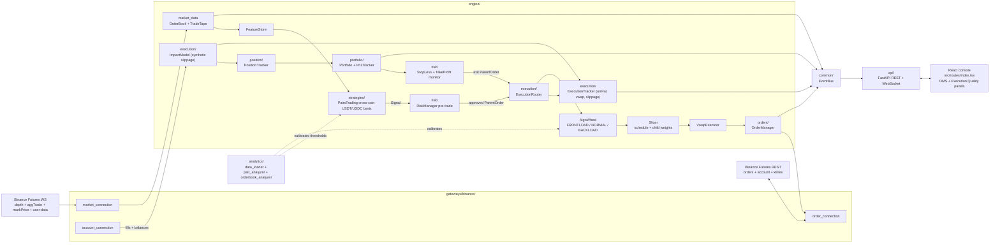
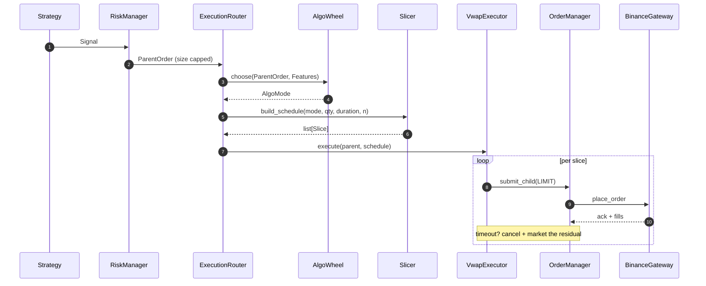

# ALPHA-7 trading backend

Python backend that powers the React console at the repo root. Runs locally, connects to the Binance USDT-M Futures Testnet, executes a pluggable pairs-trading strategy across the USDT vs USDC perps, applies a VWAP algo wheel for execution, and enforces real-time risk.

## Architecture



## What this is

The folders in this codebase as required in the project:
       |
| Analytical module           | `analytics/` (offline) + `engine/market_data/` (live)        |
| Risk management module      | `engine/risk/` + `engine/portfolio/` + `engine/position/`    |
| Execution module            | `engine/execution/` + `engine/orders/`                       |

The engine is fully event-driven (asyncio). The FastAPI surface and the trading loop share a single event loop so the API can read engine state without locks or IPC.

## Quick start

```powershell
# From backend/
python -m venv .venv
.\.venv\Scripts\Activate.ps1
pip install -r requirements.txt

copy .env.example .env
# edit .env and paste your Binance Futures Testnet API key + secret

python main.py
```

POSIX equivalent:

```bash
python -m venv .venv && source .venv/bin/activate
pip install -r requirements.txt
cp .env.example .env
python main.py
```

The single Windows convenience script `run.bat` does the venv bootstrap + dependency install + launch in one shot:

```powershell
.\run.bat
```

The console is then served at `http://127.0.0.1:8000` (REST + WS). Start the React frontend in a second terminal from the repo root:

```bash
bun install
bun run dev   # http://localhost:5173
```

## Folder layout

```
backend/
  main.py                    entrypoint: starts engine + FastAPI together
  run.bat                    Windows launcher
  requirements.txt
  pyproject.toml             pytest + ruff config
  README.md                  this file
  AGENTS.md                  commenting / style guide
  .env.example

  common/                    config, EventBus, enums, shared dataclasses
  gateways/                  abstract venue interface + Binance Futures adapter
    binance/
      rest_client.py         signed httpx wrapper
      market_connection.py   public WS: bookTicker + aggTrade + depth
      order_connection.py    REST orders + user-data WS
      account_connection.py  balances + positions
      binance_gateway.py     composes the three above

  engine/                    strategy-agnostic trading core
    core/                    Engine orchestrator + heartbeat clock + state
    market_data/             OrderBook + TradeTape + FeatureStore
    orders/                  OrderManager (parent/child OMS)
    execution/               AlgoWheel + Slicer + VwapExecutor + ExecutionRouter
                             + ImpactModel + ExecutionTracker
    position/                PositionTracker (mark-to-market + realised PnL)
    portfolio/               Portfolio (cash + equity curve)
    risk/                    Limits + PnLTracker + StopLossMonitor + RiskManager
    strategies/              StrategyBase + PairsTradingStrategy
    performance/             PerformanceTracker (win rate + trade history)
    main_engine.py           CLI to run the engine without the API

  analytics/                 offline calibration jobs
    data_loader.py           pulls klines into data/*.parquet
    pair_analyzer.py         z-score + cointegration + half-life
    orderbook_analyzer.py    trade-tape distributions for the AlgoWheel
    reports.py               JSON / CSV writers

  api/                       FastAPI surface
    server.py                app factory + lifespan + CORS
    schemas.py               Pydantic DTOs that mirror src/components/algo/mockData.ts
    routes/                  status, positions, trades, orders, execution, logs, control
    ws.py                    /ws WebSocket pump

  tests/                     pytest suite (mocks live ONLY here)
  data/                      gitignored cache of parquet/JSON artefacts
  docs/                      architecture.mmd
```

## Module deep-dives

### Analytical module — `analytics/` + `engine/market_data/`

Live, hot-path microstructure features:

- `engine/market_data/orderbook.py` — incremental L2 book (snapshot + diff). Exposes `imbalance(top_n)`, `micro_price`, `spread_bps`.
- `engine/market_data/trade_tape.py` — `window_sec`-rolling tape. Classifies each trade as bid-hit (sell-init) or ask-hit (buy-init) using Binance's `m` flag and computes the ratio fed to the AlgoWheel.
- `engine/market_data/feature_store.py` — read-through `Features` snapshot, the only object strategies see.

Offline calibration (in `analytics/`):

```bash
python -m analytics.data_loader --symbols BTCUSDT,BTCUSDC --interval 1m --days 7
python -m analytics.pair_analyzer --base BTC --interval 1m --window 60
python -m analytics.orderbook_analyzer --symbol BTCUSDT --window-sec 300
```

`pair_analyzer` writes `data/pair_<base>.json` (spread mean / std, half-life, Engle-Granger p-value, suggested entry/exit z). `orderbook_analyzer` writes `data/orderbook_<symbol>.json` (taker-buy-share percentiles used to set the wheel's `hit_ratio_threshold`).

### Execution module — `engine/execution/`

Sequence per parent order:



Wheel decision rule (mirrors `engine/execution/algo_wheel.py`):

- **BUY** + bid-imbalance > +T + ask-hit ratio > 0.6 → `FRONTLOAD` (book leaning long, buyers aggressive)
- **BUY** + ask-imbalance > +T + bid-hit ratio > 0.6 → `BACKLOAD` (sellers stacked, let it bleed lower)
- **SELL** is the symmetric mirror
- otherwise → `NORMAL`

Slicer weights are uniform for `NORMAL`, exponential decay for `FRONTLOAD`, reverse exponential for `BACKLOAD`. Total qty is conserved exactly — rounding drift folds into the last child.

#### Synthetic market impact (testnet only)

Binance Futures Testnet has unrealistically deep books, so live fills look way too clean for honest TCA. `engine/execution/impact_model.py` adjusts every recorded fill price by an estimated mainnet cost so the dashboard's PnL preview matches reality:

```
impact_bps = k * sqrt(qty / consumable_depth) * 10_000
```

`k` defaults to `0.5` (`IMPACT_K` in `.env`). The adjustment is sign-aware (BUY pays more, SELL receives less) and applied at `Engine._on_fill`. The raw venue price is preserved on `Fill.venue_price` for the audit trail; only `Fill.price` (the engine-effective price used by `PositionTracker`) is shifted. Set `IMPACT_MODEL_ENABLED=false` to disable and use raw fills.

#### Execution-quality tracking

`engine/execution/execution_metrics.py` (`ExecutionTracker`) captures per-parent stats across the whole order lifecycle:

| Metric          | Definition                                                    |
| --------------- | ------------------------------------------------------------- |
| `arrival_price` | Mid at the moment `ExecutionRouter.submit` is called          |
| `vwap_price`    | Volume-weighted average of all child fills (uses venue price) |
| `slippage_bps`  | `(vwap - arrival) / arrival * 10000 * sign(side)` — positive = adverse |
| `impact_bps`    | qty-weighted aggregate from `ImpactModel`                     |
| `fill_ratio`    | `filled_qty / requested_qty`                                  |
| `duration_sec`  | Submit → final fill                                           |

Reports stream live on `EventType.PARENT_UPDATE` and `EventType.EXECUTION_REPORT`, and aggregate stats are exposed at `GET /api/execution`. The dashboard's "Execution Quality" panel renders the rolling 100-parent history.

### Strategy — `engine/strategies/pairs_trading.py`

Binance Futures Testnet has no tradable USDT/USDC perp, so we *imply* the stablecoin basis from every coin quoted in both stables (BTC, ETH, SOL, ...):

```
BTC = BTCUSDT * USDT = BTCUSDC * USDC
=> USDT/USDC = BTCUSDC / BTCUSDT
=> basis_i = log(coinUSDC.mid) - log(coinUSDT.mid)   for each coin i
```

`basis_i` is the per-coin implied log(USDT/USDC). Pooling across all configured pairs gives a consensus rate that captures the *actual* stablecoin direction the user wants to track:

```
reference   = mean(basis_i)
deviation_i = basis_i - reference
z_i         = (deviation_i - rolling_mean(deviation_i)) / rolling_std
```

Trade rule per coin:

- `z_i >= +entry_z` (default `2.0`) → USDC leg unusually rich → **SHORT coinUSDC, LONG coinUSDT**
- `z_i <= -entry_z`                  → USDT leg unusually rich → **LONG  coinUSDC, SHORT coinUSDT**
- `|z_i| <= exit_z` (default `0.5`)  → unwind on convergence

This is more robust than naively trading `BTCUSDT - BTCUSDC` because a real USDT/USDC move (which lifts the basis on every coin) is absorbed by the reference mean instead of triggering false entries.

`PairsTradingStrategy.reference_basis()` exposes the live consensus for offline calibration.

### Risk module — `engine/risk/` + `engine/portfolio/` + `engine/position/`

Pre-trade gate (`RiskManager.check`): caps signal qty at `max_risk_pct` of equity, rejects on `max_gross_notional` breach, returns either an approved (possibly downscaled) qty or a veto with a reason.

Live monitor (`RiskManager.monitor_tick`): per tick, evaluates the position's `StopBracket` (configured from `default_stop_loss_pct` / `default_take_profit_pct`) and emits an `ExitIntent` when the bid/ask crosses a threshold. A drawdown breach trips the kill switch and flattens.

`PositionTracker` folds fills into a per-symbol weighted-entry position, splits realised PnL on partial closes, and handles flips (short → long) cleanly. `Portfolio` sits on top: cash + positions + equity curve, all read by the dashboard.

### Code structure & quality

See `AGENTS.md`. Highlights:

- One-way dependency graph (`common/` <- `gateways/` + `engine/` <- `api/` + `analytics/`).
- Single in-process `EventBus` (asyncio.Queue fan-out) is the only cross-module coupling.
- All Binance access goes through `gateways/binance/binance_gateway.py` so the engine swaps to a `MockGateway` in tests with zero engine changes (no mocks in dev/prod, only tests).
- File length capped ~250 LOC; modules split by responsibility.

## Configuration reference

Loaded from `backend/.env` via `pydantic-settings` in `common/config.py`. Defaults shown.

| Key                          | Default                              | Effect |
| ---------------------------- | ------------------------------------ | ------ |
| `BINANCE_API_KEY`            | _required_                           | Futures Testnet API key |
| `BINANCE_API_SECRET`         | _required_                           | Futures Testnet secret |
| `BINANCE_TESTNET`            | `true`                               | Pin to testnet endpoints |
| `BINANCE_REST_BASE`          | `https://testnet.binancefuture.com`  | REST host |
| `BINANCE_WS_BASE`            | `wss://stream.binancefuture.com`     | WS host |
| `SYMBOLS`                    | `BTCUSDT,BTCUSDC,...`                | Subscribed symbols (must include both legs of each pair) |
| `BASE_CURRENCY`              | `USDT`                               | Equity / PnL denomination |
| `MAX_RISK_PCT`               | `0.35`                               | Max equity fraction risked per signal (UI slider) |
| `MAX_GROSS_NOTIONAL`         | `50000`                              | Hard cap on total open notional |
| `MAX_DRAWDOWN_PCT`           | `0.10`                               | Drawdown that trips the kill switch |
| `DEFAULT_STOP_LOSS_PCT`      | `0.005`                              | Per-position SL distance |
| `DEFAULT_TAKE_PROFIT_PCT`    | `0.010`                              | Per-position TP distance |
| `VWAP_DURATION_SEC`          | `60`                                 | Parent-order duration |
| `VWAP_NUM_SLICES`            | `6`                                  | Children per parent |
| `IMBALANCE_TOP_N`            | `10`                                 | L2 levels per side for imbalance |
| `TRADE_TAPE_WINDOW_SEC`      | `300`                                | Rolling window for hit-ratios |
| `IMPACT_MODEL_ENABLED`       | `true`                               | Bake synthetic mainnet impact into recorded fill prices |
| `IMPACT_K`                   | `0.5`                                | Square-root impact coefficient |
| `API_HOST` / `API_PORT`      | `127.0.0.1` / `8000`                 | FastAPI bind |
| `CORS_ORIGINS`               | `http://localhost:5173,...`          | Allowed origins for the frontend |

## REST + WebSocket contract

All payloads use the same field names as `src/components/algo/mockData.ts` so the frontend binds without translation.

| Method | Path                       | Body / Query        | Returns                              |
| ------ | -------------------------- | ------------------- | ------------------------------------ |
| GET    | `/api/state`               |                     | Full hydrate (status + KPI + equity + positions + trades + orders + execution) |
| GET    | `/api/status`              |                     | `{status, uptime_sec}`               |
| GET    | `/api/equity`              |                     | `{equity[], last_ts}`                |
| GET    | `/api/positions`           |                     | `Position[]`                         |
| GET    | `/api/trades`              | `?limit=40`         | `Trade[]`                            |
| GET    | `/api/orders`              |                     | `{working: ChildOrderDTO[]}` for the OMS panel |
| GET    | `/api/execution`           |                     | `{working[], history[], aggregate}` for execution quality |
| GET    | `/api/logs`                | `?limit=60`         | `LogEntry[]`                         |
| POST   | `/api/control/start`       |                     | new `StatusDTO`                      |
| POST   | `/api/control/pause`       |                     | new `StatusDTO`                      |
| POST   | `/api/control/resume`      |                     | new `StatusDTO`                      |
| POST   | `/api/control/stop`        |                     | new `StatusDTO`                      |
| POST   | `/api/control/flatten`     |                     | new `StatusDTO`                      |
| PATCH  | `/api/control/risk`        | `{max_risk_pct}`    | new `StatusDTO`                      |
| WS     | `/ws`                      |                     | stream of `{type, ts, data}` events  |

WebSocket event types: `tick`, `fill`, `order`, `parent`, `execution`, `position`, `equity`, `log`, `status`. `parent` is emitted on every child fill of an in-flight VWAP; `execution` is the post-trade report when a parent completes. The dashboard hook in `src/hooks/useAlgoStream.ts` is the canonical consumer.

## Testing

```bash
cd backend
pip install -r requirements.txt
pytest -q
```

Highlights:

- `test_orderbook.py` covers snapshot + diff + imbalance.
- `test_trade_tape.py` covers eviction + ratios.
- `test_algo_wheel.py` exercises every branch of the mode-selection rule.
- `test_slicer.py` checks weight monotonicity + total-qty conservation.
- `test_position_tracker.py` covers weighted entries, partial closes, and flips.
- `test_risk_manager.py` covers qty caps, kill switch, and the no-position monitor path.
- `test_pairs_trading.py` confirms paired signal emission on cross-coin deviation + reference-basis tracking.
- `test_vwap_executor.py` runs the executor end-to-end against an in-test `MockGateway`.
- `test_impact_model.py` covers sign convention + square-root scaling of synthetic impact.
- `test_execution_metrics.py` covers per-parent slippage, vwap, and the completion lifecycle.

## Troubleshooting

- **"Signature for this request is not valid"** — usually a clock-skew issue on Windows. The signed REST client uses `time.time()`; sync the system clock with `w32tm /resync`.
- **WebSocket disconnects every ~24h** — Binance enforces a 24h max per stream connection. The `MarketConnection` reconnect loop handles it transparently; you'll see one `WARN market_ws disconnected` followed by a successful reconnect.
- **`listenKey` expired** — `OrderConnection` refreshes every 30 minutes (Binance expires at 60). If the keepalive task crashes you'll see WARN logs and an automatic re-fetch on the next iteration.
- **Order rejected with code -2019 (Margin is insufficient)** — check `MAX_RISK_PCT` and your testnet wallet balance. The pre-trade gate caps qty by equity but does not (yet) account for required initial margin at high leverage.
- **Engine boots but no signals fire** — pairs-trading needs ~30 samples to compute a z-score; with 1Hz ticks expect ~30s of warm-up before any entry signals. Confirm both legs of a pair appear in `SYMBOLS`.
