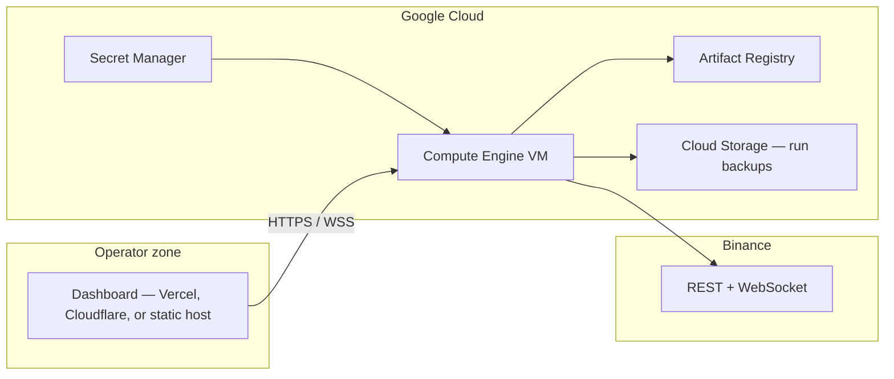

# Google Cloud deployment

This guide runs **Algo Trading Hub** on Google Cloud. The trading engine is a **single long-lived process** (engine + FastAPI + WebSockets). That shape fits **Compute Engine + Docker**, not serverless request handlers.

| Component | Recommended on GCP | Notes |
|-----------|------------------|-------|
| **Backend** (engine + API) | Compute Engine VM + Docker | Persistent disk for `data/runs/`, stable outbound IPs to Binance |
| **Dashboard** (React) | **Vercel** ([`../vercel/README.md`](../vercel/README.md)), Cloudflare Workers, or any HTTPS host | Set `VITE_API_BASE` to your API URL at build time |
| **Run archive backup** | Cloud Storage | Optional cron via `scripts/sync-runs-to-gcs.sh` |
| **Secrets** | Secret Manager | Inject into VM `.env` or startup script |
| **CI image build** | Cloud Build | Root [`cloudbuild.yaml`](../../cloudbuild.yaml) |

**Do not use Cloud Run for the live engine** unless you redesign for stateless, short-lived workers. Cloud Run request timeouts and multi-instance scaling conflict with the engine’s single-writer, always-on WebSocket model ([`docs/OPERATIONS.md`](../../docs/OPERATIONS.md)).

---

## Architecture



---

## Quick start (manual)

### 1. Prerequisites

- GCP project with billing enabled
- [`gcloud`](https://cloud.google.com/sdk/docs/install) CLI authenticated
- Binance API keys (testnet recommended first)

```bash
export PROJECT_ID=your-project
export REGION=us-central1
gcloud config set project "$PROJECT_ID"
gcloud services enable compute.googleapis.com artifactregistry.googleapis.com \
  cloudbuild.googleapis.com secretmanager.googleapis.com
```

### 2. Build and push the backend image

```bash
gcloud artifacts repositories create algo-trading \
  --repository-format=docker --location="$REGION" || true

gcloud builds submit --config=cloudbuild.yaml \
  --substitutions=_REGION="$REGION",_REPOSITORY=algo-trading
```

Image tag: `$REGION-docker.pkg.dev/$PROJECT_ID/algo-trading/backend:latest`

Local build (optional):

```bash
docker build -f backend/Dockerfile -t algo-trading-backend backend
```

### 3. Provision a VM (Terraform or console)

**Terraform (optional):**

```bash
cd deploy/gcp/terraform
cp terraform.tfvars.example terraform.tfvars
# edit project_id, zone, api_allowed_cidr_blocks
terraform init && terraform apply
```

**Or** create a Debian 12 VM (`e2-standard-4`, 100 GB data disk), attach a service account with `roles/artifactregistry.reader`, and run [`scripts/bootstrap-vm.sh`](scripts/bootstrap-vm.sh).

### 4. Configure and start on the VM

SSH (prefer [IAP tunnel](https://cloud.google.com/iap/docs/using-tcp-forwarding)):

```bash
gcloud compute ssh algo-trading-engine --zone=us-central1-a --tunnel-through-iap
```

On the VM:

```bash
sudo mkdir -p /opt/algo-trading-hub /var/lib/algo-trading/data
# rsync or git clone the repo into /opt/algo-trading-hub

cd /opt/algo-trading-hub/deploy/gcp
sudo cp env.gcp.example .env
sudo nano .env   # IMAGE, BINANCE_*, API_TOKEN, CORS_ORIGINS

sudo docker compose pull
sudo docker compose up -d
curl -s http://127.0.0.1:8000/health
```

Important `.env` keys:

| Variable | Production guidance |
|----------|---------------------|
| `API_HOST` | `0.0.0.0` inside the container |
| `API_TOKEN` | Long random value; required for `/api/control` |
| `CORS_ORIGINS` | Exact dashboard origin(s), e.g. `https://your-app.vercel.app` or `https://trading.yourfirm.com` |
| `ENGINE_AUTOSTART` | `false` until you have verified keys and testnet |
| `TRADING_MODE` | `paper` on testnet first; `live` only after sign-off |

Compose binds the API to **localhost only** (`127.0.0.1:8000`). Put **nginx** ([`nginx/algo-trading.conf`](nginx/algo-trading.conf)) or a Google HTTPS load balancer in front for TLS and IP allowlists.

### 5. Connect the dashboard

The UI is deployed separately from the engine. **Recommended:** Vercel — see [`../vercel/README.md`](../vercel/README.md).

Set build-time env vars (Vercel project settings or local `.env`):

```bash
VITE_API_BASE=https://api.yourdomain.com
VITE_API_TOKEN=your-api-token   # optional; must match API_TOKEN for control actions
```

Then deploy via Vercel Git integration (`npm run build` runs automatically) **or** Cloudflare Workers (`npm run build:cloudflare` + `wrangler deploy`).

The browser must reach **`wss://`** when the page is **`https://`** ([`docs/OPERATIONS.md`](../../docs/OPERATIONS.md)).

**Security:** `VITE_API_TOKEN` is embedded in the client bundle. Restrict dashboard access (VPN, IAP, Cloudflare Access). See [`docs/SECURITY.md`](../../docs/SECURITY.md).

---

## Secret Manager (recommended)

```bash
# Create secrets
echo -n 'your-binance-key' | gcloud secrets create binance-api-key --data-file=-
echo -n 'your-binance-secret' | gcloud secrets create binance-api-secret --data-file=-
echo -n 'your-api-token' | gcloud secrets create algo-api-token --data-file=-

# On the VM (service account needs secretAccessor)
gcloud secrets versions access latest --secret=binance-api-key >> /opt/algo-trading-hub/deploy/gcp/.env
```

Prefer writing a small startup script that exports secrets into `.env` with `0600` permissions instead of baking them into the image.

---

## systemd (auto-start on boot)

```bash
sudo cp /opt/algo-trading-hub/deploy/gcp/systemd/algo-trading.service /etc/systemd/system/
sudo systemctl daemon-reload
sudo systemctl enable --now algo-trading
```

---

## Back up run archives to GCS

```bash
export GCS_RUNS_BUCKET=gs://YOUR_PROJECT-algo-trading-runs
/opt/algo-trading-hub/deploy/gcp/scripts/sync-runs-to-gcs.sh
```

Schedule with cron on the VM. Terraform can create the bucket (`create_runs_bucket = true`).

---

## Health checks for load balancers

| Path | Use |
|------|-----|
| `GET /health` | Liveness — process up |
| `GET /ready` | Readiness — engine running **and** market/user data fresh |

Do not route trading traffic to instances where `/ready` is false during intentional pauses.

---

## TLS troubleshooting (`ERR_CERT_AUTHORITY_INVALID`)

The API hostname (`35-254-130-75.sslip.io` or your custom domain) must present a certificate trusted by the browser. The dashboard on Vercel calls `https://…/api/*` and `wss://…/ws`; if TLS fails, every request and the WebSocket show `net::ERR_CERT_AUTHORITY_INVALID`.

**On the VM, verify Let's Encrypt:**

```bash
sudo openssl x509 -in /etc/letsencrypt/live/YOUR_HOST/fullchain.pem -noout -issuer -dates
# issuer should contain "Let's Encrypt", not "Fortinet" or "self-signed"
sudo certbot renew --dry-run
curl -sI https://YOUR_HOST/health
```

Re-issue after IP change or failed first run:

```bash
sudo bash /opt/algo-trading-hub/deploy/gcp/scripts/vm-setup-nginx-sslip.sh 35-254-130-75.sslip.io
```

**Corporate SSL inspection (common on campus/VPN firewalls):** Some networks (e.g. Fortinet) replace the server's certificate with their own. Chrome then reports `ERR_CERT_AUTHORITY_INVALID` even when the VM cert is valid. Check the certificate issuer in the browser padlock — if it says **Fortinet** (or your org), not **Let's Encrypt**:

- Use a network without SSL inspection (home/mobile hotspot), or
- Install your organization's root CA on the device, or
- Ask IT to bypass inspection for your API hostname.

**Long-term:** Point a domain you control (e.g. `api.yourfirm.com`) at the VM IP and use [`nginx/algo-trading.conf`](nginx/algo-trading.conf) + certbot. That avoids sslip.io rate limits and is easier for IT allowlists.

---

## Production checklist

- [ ] VM in a VPC; API not on the public internet without TLS + IP allowlist or IAP
- [ ] `API_TOKEN` set; dashboard behind identity controls
- [ ] `TRADING_MODE` and Binance hosts aligned (`live` → mainnet only)
- [ ] NTP/chrony enabled (Binance clock skew)
- [ ] Persistent data disk for `/app/data`
- [ ] GCS backup for `data/runs/`
- [ ] `ALERT_WEBHOOK_URL` or log export to Cloud Logging

---

## Files in this folder

| Path | Purpose |
|------|---------|
| [`docker-compose.yml`](docker-compose.yml) | Run engine container on the VM |
| [`env.gcp.example`](env.gcp.example) | Environment template |
| [`nginx/algo-trading.conf`](nginx/algo-trading.conf) | TLS + WebSocket reverse proxy |
| [`systemd/algo-trading.service`](systemd/algo-trading.service) | Boot-time compose |
| [`scripts/bootstrap-vm.sh`](scripts/bootstrap-vm.sh) | Install Docker + nginx on a fresh VM |
| [`scripts/sync-runs-to-gcs.sh`](scripts/sync-runs-to-gcs.sh) | Backup JSONL runs |
| [`terraform/`](terraform/) | Optional VM + disk + firewall + GCS |

**GitHub auto-deploy (push to `main`):** [`GITHUB_ACTIONS_SETUP.md`](GITHUB_ACTIONS_SETUP.md)

Related: [`../vercel/README.md`](../vercel/README.md) · [`../../cloudbuild.yaml`](../../cloudbuild.yaml) · [`../../docs/OPERATIONS.md`](../../docs/OPERATIONS.md) · [`../../docs/SECURITY.md`](../../docs/SECURITY.md)
