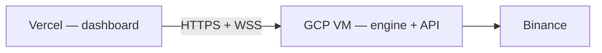

# Deploy dashboard to Vercel + backend on GCP

Split deployment: **TanStack Start dashboard on Vercel**, **trading engine + FastAPI on Google Compute Engine** ([`../gcp/README.md`](../gcp/README.md)).



---

## 1. Deploy the backend on GCP

Follow [`../gcp/README.md`](../gcp/README.md) through step 4:

- VM + Docker Compose running the engine image
- nginx (or a load balancer) exposing **`https://api.yourdomain.com`**
- `API_TOKEN` set on the VM
- **`CORS_ORIGINS`** includes your Vercel URL(s) (see below)

Verify from your machine:

```bash
curl -s https://api.yourdomain.com/health
```

---

## 2. Import the repo on Vercel

1. [vercel.com/new](https://vercel.com/new) → import this Git repository.
2. **Root directory:** repository root (where `package.json` lives).
3. **Framework preset:** Vercel auto-detects TanStack Start when `nitro` is in `vite.config.ts` (set via `VERCEL=1` during build).
4. **Build command:** `npm run build` (default).
5. **Do not** set a custom Output Directory — Nitro writes `.vercel/output` automatically.

---

## 3. Environment variables (Vercel project settings)

Set for **Production** (and **Preview** if you use preview deployments):

| Variable | Example | Required |
|----------|---------|----------|
| `VITE_API_BASE` | `https://api.yourdomain.com` | Yes |
| `VITE_API_TOKEN` | same as GCP `API_TOKEN` | Recommended for control actions |

No trailing slash on `VITE_API_BASE`. The UI builds WebSocket URLs as `wss://…/ws` when the page is served over HTTPS.

**Security:** `VITE_API_TOKEN` is shipped in the browser bundle. Use Vercel authentication, a VPN, or Cloudflare Access in front of the dashboard. See [`../../docs/SECURITY.md`](../../docs/SECURITY.md).

---

## 4. CORS on the GCP backend

In `deploy/gcp/.env` on the VM:

```env
CORS_ORIGINS=https://your-project.vercel.app,https://your-custom-domain.com
```

Include:

- Production Vercel URL (`https://<project>.vercel.app`)
- Custom domain if you attach one in Vercel
- Preview URLs if operators use branch previews (each preview has its own `*.vercel.app` host — list them or use a stable preview domain)

Redeploy/restart the engine container after changing `.env`:

```bash
cd /opt/algo-trading-hub/deploy/gcp
sudo docker compose up -d
```

---

## 5. Deploy

Push to the connected branch or run:

```bash
npx vercel --prod
```

Open the Vercel URL → the console should load KPIs once the engine is running and `/ready` is healthy.

---

## Local builds

| Command | Target |
|---------|--------|
| `npm run dev` | Vite dev server (proxies `/api`, `/ws` to localhost:8000) |
| `npm run build:vercel` | Nitro bundle (same as Vercel CI) |
| `npm run build:cloudflare` | Cloudflare Workers bundle (`wrangler deploy`) |

---

## Troubleshooting

| Symptom | Fix |
|---------|-----|
| Vercel build OK but **404** on all routes | Ensure `nitro({ preset: "vercel" })` in `vite.config.ts`; `vercel.json` uses `"framework": "tanstack-start"`. |
| **`Failed to fetch dynamically imported module`** / 404 on `/assets/index-*.js` | Stale deploy or wrong Nitro preset. **Redeploy** with “Clear build cache”; hard-refresh browser (Ctrl+Shift+R). Hashes in the URL must match one deploy. |
| **CORS** errors in browser | Add exact Vercel origin to GCP `CORS_ORIGINS`. |
| **Mixed content** | Page must be `https://` and `VITE_API_BASE` must be `https://` (not `http://`). |
| WebSocket disconnects | Confirm nginx `/ws` upgrade config ([`../gcp/nginx/algo-trading.conf`](../gcp/nginx/algo-trading.conf)). |
| Control buttons return **401** | Set matching `VITE_API_TOKEN` and GCP `API_TOKEN`. |

---

## Related

- [`../gcp/README.md`](../gcp/README.md) — engine VM, secrets, TLS
- [`../../docs/OPERATIONS.md`](../../docs/OPERATIONS.md) — runbook
- [`../../docs/SECURITY.md`](../../docs/SECURITY.md) — tokens and network policy
