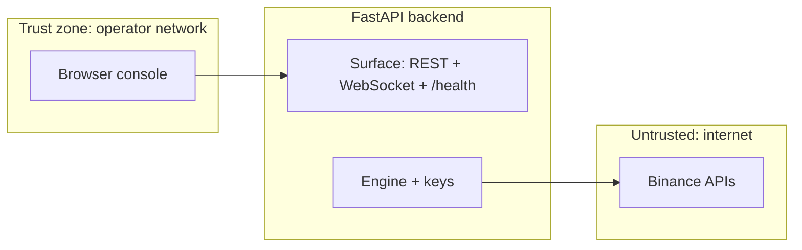

# Security model and hardening guide

This document describes how **Algo Trading Hub** handles authentication, secrets, and trust boundaries, and how to harden it for institutional deployment. It is **not** a certified security assessment; engage independent review for production sign-off.

---

## 1. Trust boundaries

| Boundary | Trust assumption |
|----------|------------------|
| **Operator browser ↔ API** | Same policy zone as “who may trade.” Anyone who can send authenticated control requests can start/stop/flatten and trip breakers. |
| **API ↔ Binance** | Mutual TLS is venue-defined; you rely on HTTPS/WSS and API key signing as implemented in `gateways/binance/`. |
| **API ↔ Other clients** | Any host that can reach REST/WebSocket endpoints inherits the same exposure as the console unless additional controls are applied. |

---

## 2. Authentication and authorization

### 2.1 Control API (`/api/control`)

When **`API_TOKEN`** is non-empty (`Settings.api_token`, `backend/common/config.py`):

- Requests to **`/api/control*`** must include `Authorization: Bearer <API_TOKEN>` or receive **401** (`backend/api/server.py` middleware).

**Scope:** This applies to **all** HTTP methods under `/api/control` when the token is set (including `GET` breakers).

**Gap if token is empty:** Control routes are **unauthenticated** — acceptable **only** on isolated localhost development.

### 2.2 Read-only API and WebSocket

The following are **not** guarded by `API_TOKEN` in middleware:

- `GET /api/state`, `GET /api/positions`, `GET /api/execution`, `GET /api/settings`, etc.
- **`GET /ws`** event stream

**Institutional implication:** Treat the **entire FastAPI surface** as sensitive if it exposes positions, PnL, or logs. Network controls (private VPC, mTLS, reverse proxy auth) are **required** for production unless you extend the codebase to authenticate reads and WebSocket.

### 2.3 Frontend token (`VITE_API_TOKEN`)

`src/lib/api.ts` injects `Authorization` for **mutating** `/api/control` requests when `VITE_API_TOKEN` is set.

**Critical limitation:** Vite bakes this into the **client JavaScript bundle**. Anyone who can load the UI can extract the token. Mitigations:

- Deploy the console only inside a **trusted network** or behind an **identity-aware proxy** that already gates access.
- Prefer **short-lived** operator sessions issued by your IdP (would require code changes — not present in-tree).
- Never use the same secret for API and long-lived bank-grade credentials without rotation policy.

---

## 3. Secrets management

| Secret | Purpose | Storage |
|--------|---------|---------|
| `BINANCE_API_KEY` / `BINANCE_API_SECRET` | Venue signing | Environment / vault — **never** commit; `.env` gitignored |
| `API_TOKEN` | Control-plane HTTP | Environment / vault |
| `ALERT_WEBHOOK_URL` | Outbound alerts | May carry capability URLs — protect as secret |

**Settings dump:** `GET /api/settings` returns masked settings — verify masking in `backend/api/routes/settings.py` before exposing externally.

---

## 4. CORS and browser policy

`CORSMiddleware` allows configured origins plus a regex for localhost/127.0.0.1 (`backend/api/server.py`).

**Production:** Set `CORS_ORIGINS` explicitly to **known** console origins only. Avoid `*` with credentials.

---

## 5. Transport security

| Path | Dev default | Production expectation |
|------|-------------|------------------------|
| Browser → API | `http` via Vite proxy | **`https`** termination (load balancer / reverse proxy) |
| Browser → WebSocket | `ws` via proxy | **`wss`** when page is `https` |
| API → Binance | HTTPS/WSS per settings | Mainnet endpoints + HSTS as provided by venue |

---

## 6. Supply chain and dependencies

- **Python:** pin versions in `backend/requirements.txt` (or migrate to lockfile policy per your org).
- **JavaScript:** `package.json` + lockfile discipline (`package-lock`/`bun.lock` if used).
- Run organisational **SCA** (Dependabot, Snyk, etc.) and **license** review before production.

---

## 7. Logging and PII

- Logs and JSONL may contain **symbols, sizes, prices, alerts** — classify per your data policy.
- **No deliberate PII** is required for trading, but operator `detail` strings in breaker trips could include free text — train operators accordingly.

---

## 8. Hardening checklist (summary)

- [ ] **Bind address:** Prefer loopback or private interface; put public access behind reverse proxy.
- [ ] **API_TOKEN:** Required; rotate on operator offboarding.
- [ ] **Network policy:** Restrict who can reach `/api/*` and `/ws` (beyond CORS — **IP allow lists**, VPN, Zero Trust).
- [ ] **WebSocket auth:** Consider extending `backend/api/ws.py` with token query/header if exposing API beyond trusted network.
- [ ] **Read path auth:** Consider API gateway JWT for `GET /api/state` if dashboards are internet-facing.
- [ ] **Secrets:** Inject via vault; audit `.env` permissions on servers.
- [ ] **Break-glass:** Document manual venue cancel / flatten if control plane is compromised.

---

## 9. Reporting vulnerabilities

Institutional users should route findings through their **internal security team** and, if applicable, responsible disclosure to exchange vendors for API-side issues outside this repo.
